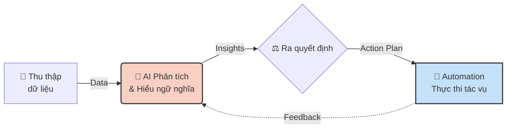

> [!nav] Điều hướng
> **Bài trước:** [[00-N8N 101 - Mục lục]]
> **Bài tiếp theo:** [[02-Giới thiệu n8n và triết lý low-code]]

> [!info] Mục tiêu bài học
> Bài học này cung cấp cái nhìn tổng quan về Trí tuệ nhân tạo (AI) và Tự động hóa (Automation), cũng như sức mạnh khi kết hợp hai khái niệm này lại với nhau.

## I. Giới thiệu: Trí tuệ nhân tạo (AI)
### 1.1. AI là gì?
Trí tuệ nhân tạo (AI) là khả năng của máy móc trong việc thực hiện các nhiệm vụ thông minh tương tự con người. Điểm cốt lõi của AI là nó không chỉ thực thi mệnh lệnh một cách máy móc mà còn có khả năng học hỏi và tự đưa ra quyết định.

### 1.2. Ưu điểm và Hạn chế của AI
**Ưu điểm:**
- **Xử lý dữ liệu lớn:** AI có khả năng phân tích các bộ dữ liệu khổng lồ mà con người không thể xử lý.
- **Tiết kiệm thời gian và tăng hiệu suất:** AI giúp tự động hóa các tác vụ phức tạp, từ đó tiết kiệm thời gian và nâng cao năng suất công việc.
- **Cải thiện cuộc sống:** AI được ứng dụng rộng rãi để cải thiện chất lượng sống, từ dự báo thời tiết, cá nhân hóa trải nghiệm, cho đến lọc email rác.

**Hạn chế:**
- **Phụ thuộc vào dữ liệu:** AI học từ dữ liệu được cung cấp, do đó nó có thể bị thiên lệch hoặc đưa ra kết quả không chính xác nếu dữ liệu đầu vào không tốt.
- **Thiếu sáng tạo và cảm xúc:** AI vẫn còn hạn chế trong việc tái tạo sự sáng tạo và cảm xúc phức tạp của con người.
- **Cần sự giám sát:** Để đảm bảo tính xác thực, các hệ thống AI thường cần sự giám sát của con người.

### 1.3. Ứng dụng của AI
AI đã và đang len lỏi vào mọi khía cạnh của công nghệ và đời sống.

**Trong lĩnh vực công nghệ:**
- Nhận dạng giọng nói và khuôn mặt.
- Hệ thống khuyến nghị thông minh (gợi ý sản phẩm, phim ảnh).
- Phát hiện gian lận trong các giao dịch tài chính.

**Trong đời sống:**
- **Giáo dục:** Cá nhân hóa lộ trình học tập.
- **Y tế:** Hỗ trợ chẩn đoán bệnh.
- **Tài chính:** Quản lý và phân tích rủi ro.
- **Sản xuất:** Tối ưu hóa dây chuyền và kiểm soát chất lượng.

---

## II. Tự Động Hóa (Automation)
### 2.1. Automation là gì?
Automation (Tự động hóa) là việc sử dụng công nghệ để thực hiện các công việc thay thế cho sức người. Mục tiêu chính của automation là tăng hiệu quả, độ chính xác, đồng thời giảm thiểu lỗi do con người và tiết kiệm thời gian.

### 2.2. Automation mang lại lợi ích gì?
- **Tăng tốc độ xử lý:** Máy móc có thể thực hiện các công việc lặp đi lặp lại nhanh hơn con người rất nhiều.
- **Giảm chi phí nhân sự:** Tự động hóa các quy trình giúp doanh nghiệp tiết kiệm chi phí vận hành.
- **Tối ưu hóa công việc thủ công:** Giải phóng con người khỏi những công việc nhàm chán, lặp đi lặp lại để tập trung vào các nhiệm vụ đòi hỏi sự sáng tạo và tư duy chiến lược.

---

## III. Mối liên hệ giữa AI và Automation
### 3.1. AI vs. Automation: Bộ não và Cơ bắp
Để dễ hình dung, hãy xem AI là "Bộ não" và Automation là "Cơ bắp".

| Đặc điểm | AI (Bộ não) | Automation (Cơ bắp) |
| :--- | :--- | :--- |
| **Nhiệm vụ chính** | Phân tích dữ liệu | Thực thi tác vụ |
| **Đặc tính** | Học hỏi, ra quyết định | Hoạt động theo quy trình có sẵn |
| **Khả năng** | Thích nghi và cải thiện | Chính xác và nhanh chóng |

> [!summary] Tóm tắt
> Automation thực hiện công việc, còn AI giúp công việc đó trở nên thông minh hơn.

### 3.2. AI Automation: Hệ thống thông minh hoàn chỉnh
Khi kết hợp với nhau, AI và Automation tạo thành một hệ thống tự động hóa thông minh, hoạt động theo một quy trình hoàn chỉnh:

1. **Thu thập dữ liệu:** Hệ thống tiếp nhận thông tin đầu vào.
2. **Hiểu và phân tích:** AI hiểu và phân tích ngữ nghĩa của dữ liệu.
3. **Ra quyết định:** AI tự động ra quyết định hoặc tạo phản hồi.
4. **Thực thi:** Automation kết nối và thực thi hành động qua các hệ thống khác.
5. **Học hỏi:** Hệ thống ghi nhận kết quả và học hỏi từ phản hồi để cải thiện.

### 3.3. Lợi ích của việc kết hợp AI và Automation
Sự kết hợp này mang lại sức mạnh vượt trội:
- Tăng năng suất làm việc một cách đột phá.
- Giảm thiểu tối đa sự phụ thuộc vào nhân lực cho các tác vụ lặp lại.
- Cải tiến chất lượng sản phẩm và dịch vụ.
- Dễ dàng mở rộng quy mô hoạt động (Scalability).

---

> [!nav] Điều hướng
> **Bài trước:** [[00-N8N 101 - Mục lục]]
> **Bài tiếp theo:** [[02-Giới thiệu n8n và triết lý low-code]]