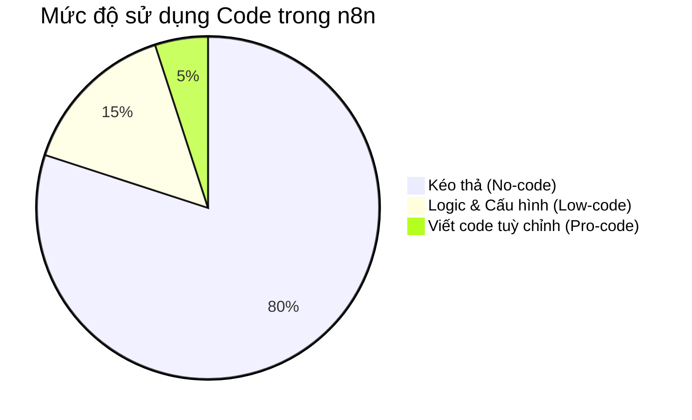

> [!nav] Điều hướng
> **Bài trước:** [[01-AI & Automation - Tổng quan và ứng dụng]]
> **Bài tiếp theo:** [[03-Cài đặt n8n Self-host qua Docker]]

## I. n8n là gì?
### 1.1. Giới thiệu chung
**n8n** là một nền tảng tự động hóa quy trình (workflow automation), cho phép bạn kết nối các ứng dụng và dịch vụ khác nhau để tạo thành các luồng công việc tự động. Điểm đặc biệt là bạn có thể làm điều này mà không cần kỹ năng lập trình chuyên sâu.

### 1.2. Các đặc điểm chính
- **Giao diện kéo thả:** Bạn xây dựng các workflow bằng cách kéo và thả các "node" (nút đại diện cho một ứng dụng hoặc hành động) và kết nối chúng lại với nhau.
- **Hỗ trợ nhiều ứng dụng và dịch vụ:** n8n có thể kết nối với hàng trăm dịch vụ khác nhau.
- **Miễn phí và linh hoạt:** n8n có phiên bản mã nguồn mở (có thể tự host miễn phí), giúp mọi người dễ dàng tiếp cận và kiểm soát hoàn toàn dữ liệu.

---

## II. Triết lý Low-code
### 2.1. Khái niệm Low-code là gì?
Low-code là một phương pháp phát triển phần mềm mà **không cần viết code hoặc viết rất ít code**. Thay vào đó, người dùng sẽ sử dụng các thành phần, chức năng có sẵn và một giao diện trực quan để xây dựng ứng dụng hoặc quy trình.

### 2.2. Lợi ích của Low-code
- **Tiết kiệm thời gian:** Xây dựng các quy trình nhanh hơn rất nhiều so với việc lập trình truyền thống.
- **Dễ dàng sử dụng:** Mở rộng khả năng tự động hóa cho cả những người không chuyên về kỹ thuật.

### 2.3. Tại sao n8n là một nền tảng low-code tốt?
n8n là một ví dụ điển hình của triết lý low-code vì nó cho phép người dùng:
- Tự động hóa các quy trình mà không cần code phức tạp.
- Sử dụng thao tác kéo-thả trực quan, dễ tiếp cận.
- Bắt đầu một cách hoàn toàn miễn phí.
- *Có thể chèn code (JavaScript/Python) vào khi cần thiết*, đảm bảo sự linh hoạt tối đa cho các tác vụ phức tạp (khắc phục nhược điểm của các nền tảng no-code).

---

## III. Vì sao nên chọn n8n?
### 3.1. Khả năng Self-hosting và Bảo mật
Một trong những lợi thế lớn nhất của n8n là khả năng **tự host**, nghĩa là bạn có thể cài đặt nó trên máy chủ hoặc máy tính cá nhân của riêng mình (như AWS, VPS, Docker, Raspberry Pi...).

**Ưu điểm:**
- **Bảo mật dữ liệu:** Dữ liệu của bạn được lưu trữ trên hạ tầng của bạn, không truyền qua máy chủ của bên thứ ba nào khác.
- **Không giới hạn (Unlimited):** Bạn không bị tính phí dựa trên số lần chạy workflow (executions) hoặc số lượng tác vụ (tasks) như các nền tảng khác (Zapier, Make).

### 3.2. Cộng đồng và Tài liệu hỗ trợ
n8n có một cộng đồng người dùng lớn mạnh và hệ thống tài liệu phong phú, bao gồm:
- Diễn đàn chính thức (Community Forum) để trao đổi và giải đáp thắc mắc.
- Tài liệu hướng dẫn chi tiết (Documentation) cho từng node và tính năng.
- Rất nhiều template có sẵn và video hướng dẫn trên các nền tảng như YouTube.

### 3.3. Tích hợp đa dạng
n8n hỗ trợ hơn 300 tích hợp (Nodes) với các ứng dụng và dịch vụ phổ biến nhất hiện nay, bao gồm:
- Email (Gmail, Outlook)
- Bảng tính & Cơ sở dữ liệu (Google Sheets, Airtable, PostgreSQL)
- Công cụ AI (OpenAI, Anthropic, Langchain)
- CRM & Quản lý công việc (HubSpot, Trello, Jira)
- ...và nhiều hơn nữa thông qua Webhook hoặc HTTP Request.

### 3.4. Ứng dụng thực tế đa ngành
Nhờ tính linh hoạt, n8n được ứng dụng trong rất nhiều lĩnh vực khác nhau:

> [!example] Một số Use Case điển hình
> - **Marketing:** Tự động thu thập lead và gửi email chăm sóc khách hàng.
> - **Quản trị / Hành chính:** Tự động tổng hợp dữ liệu, tạo báo cáo doanh thu và nhân sự hàng ngày.
> - **Học tập / Nghiên cứu:** Tự động lưu ghi chú từ trình duyệt, tóm tắt bài báo bằng AI và đẩy vào Obsidian/Google Docs.
> - **Hỗ trợ khách hàng:** Tự động trả lời các câu hỏi thường gặp qua Telegram/Slack bot hoặc phân luồng tạo phiếu hỗ trợ (ticket).

---

> [!nav] Điều hướng
> **Bài trước:** [[01-AI & Automation - Tổng quan và ứng dụng]]
> **Bài tiếp theo:** [[03-Cài đặt n8n Self-host qua Docker]]
> 
> *Tuỳ chọn cài đặt khác:*
> - [[04-Cài đặt n8n trên Instance EC2 Amazon Web Service]]
> - [[05-Cài đặt n8n trên Instance Raspberry Pi]]