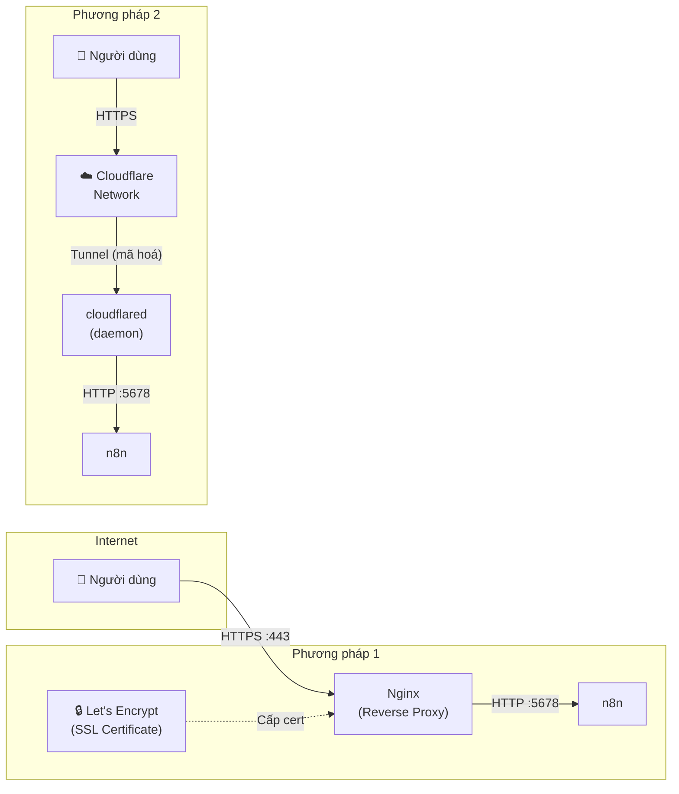

> [!nav] Điều hướng
> **Mục lục:** [[index|🏠 Wiki N8N - Trang chủ]]
> **Bài trước:** [[05-Cài đặt n8n trên Instance Raspberry Pi]]
> **Bài tiếp theo:** [[26-Backup và Restore dữ liệu n8n]]


# 🔐 Cấu hình HTTPS, Reverse Proxy (Nginx) & Cloudflare Tunnel

> [!info] Tổng quan
> Sau khi cài đặt n8n, bạn cần **bảo mật** và **public** instance ra internet một cách an toàn. Bài này hướng dẫn 2 phương pháp phổ biến nhất: dùng **Nginx + Let's Encrypt** (truyền thống) hoặc **Cloudflare Tunnel** (hiện đại, không cần mở port).

---

## 🏗️ Kiến trúc tổng quan



---

## Phương pháp 1: Nginx + Let's Encrypt

> [!tip] Khi nào dùng?
> Bạn có VPS/Server với IP tĩnh, đã trỏ domain về IP, và muốn kiểm soát toàn bộ cấu hình.

### Bước 1: Cài đặt Nginx & Certbot

```bash
# Ubuntu/Debian
sudo apt update
sudo apt install nginx certbot python3-certbot-nginx -y
```

### Bước 2: Tạo file cấu hình Nginx

```bash
sudo nano /etc/nginx/sites-available/n8n
```

Dán nội dung sau:

```nginx
server {
    listen 80;
    server_name n8n.yourdomain.com;

    location / {
        proxy_pass http://localhost:5678;
        proxy_http_version 1.1;
        
        # WebSocket support (bắt buộc cho n8n)
        proxy_set_header Upgrade $http_upgrade;
        proxy_set_header Connection "upgrade";
        
        proxy_set_header Host $host;
        proxy_set_header X-Real-IP $remote_addr;
        proxy_set_header X-Forwarded-For $proxy_add_x_forwarded_for;
        proxy_set_header X-Forwarded-Proto $scheme;
        
        # Tăng timeout cho workflow chạy lâu
        proxy_read_timeout 86400;
    }
}
```

### Bước 3: Kích hoạt và cấp SSL

```bash
# Kích hoạt site
sudo ln -s /etc/nginx/sites-available/n8n /etc/nginx/sites-enabled/
sudo nginx -t && sudo systemctl reload nginx

# Cấp certificate SSL miễn phí từ Let's Encrypt
sudo certbot --nginx -d n8n.yourdomain.com

# Auto-renew (Let's Encrypt cert hết hạn sau 90 ngày)
sudo systemctl enable certbot.timer
```

### Bước 4: Cập nhật biến môi trường n8n

Trong file `docker-compose.yml` hoặc `.env` của n8n:

```env
N8N_HOST=n8n.yourdomain.com
N8N_PORT=5678
N8N_PROTOCOL=https
WEBHOOK_URL=https://n8n.yourdomain.com/
```

---

## Phương pháp 2: Cloudflare Tunnel (Khuyến nghị)

> [!tip] Khi nào dùng?
> Chạy n8n tại nhà (không có IP tĩnh), trên Raspberry Pi, hoặc muốn **không cần mở bất kỳ port nào** trên firewall/router.

### Ưu điểm của Cloudflare Tunnel

| | Nginx truyền thống | Cloudflare Tunnel |
|---|---|---|
| Cần IP tĩnh | ✅ Bắt buộc | ❌ Không cần |
| Mở port router | ✅ Bắt buộc | ❌ Không cần |
| Cài đặt SSL | Manual | ✅ Tự động |
| Bảo vệ DDoS | ❌ Tự lo | ✅ Cloudflare CDN |
| Chi phí | Miễn phí | Miễn phí |

### Bước 1: Đăng ký Cloudflare và trỏ domain

1. Tạo tài khoản tại [cloudflare.com](https://cloudflare.com)
2. Thêm domain của bạn vào Cloudflare
3. Trỏ nameserver của domain sang Cloudflare

### Bước 2: Cài đặt cloudflared

```bash
# Trên Ubuntu/Debian
curl -L https://github.com/cloudflare/cloudflared/releases/latest/download/cloudflared-linux-amd64.deb -o cloudflared.deb
sudo dpkg -i cloudflared.deb

# Trên Raspberry Pi (ARM)
curl -L https://github.com/cloudflare/cloudflared/releases/latest/download/cloudflared-linux-arm64.deb -o cloudflared.deb
sudo dpkg -i cloudflared.deb
```

### Bước 3: Xác thực và tạo Tunnel

```bash
# Đăng nhập Cloudflare
cloudflared tunnel login

# Tạo tunnel mới
cloudflared tunnel create n8n-tunnel

# Xem Tunnel ID vừa tạo
cloudflared tunnel list
```

### Bước 4: Cấu hình tunnel

Tạo file `~/.cloudflared/config.yml`:

```yaml
tunnel: <TUNNEL_ID_CỦA_BẠN>
credentials-file: /home/user/.cloudflared/<TUNNEL_ID>.json

ingress:
  - hostname: n8n.yourdomain.com
    service: http://localhost:5678
  - service: http_status:404
```

### Bước 5: Tạo DNS record và chạy tunnel

```bash
# Tạo DNS CNAME tự động
cloudflared tunnel route dns n8n-tunnel n8n.yourdomain.com

# Chạy tunnel (thử nghiệm)
cloudflared tunnel run n8n-tunnel

# Cài làm service (chạy tự động khi reboot)
sudo cloudflared service install
sudo systemctl enable cloudflared
sudo systemctl start cloudflared
```

---

## ✅ Kiểm tra sau khi cấu hình

```bash
# Kiểm tra Nginx đang chạy
sudo systemctl status nginx

# Kiểm tra SSL certificate
sudo certbot certificates

# Kiểm tra Cloudflare tunnel
cloudflared tunnel info n8n-tunnel

# Test truy cập
curl -I https://n8n.yourdomain.com
```

---

> [!warning] Bảo mật bổ sung
> - Bật **2FA** trên tài khoản n8n (`Settings → Users`)
> - Dùng **Cloudflare Access** để thêm lớp xác thực trước khi vào n8n
> - Cấu hình **Basic Auth** trong Nginx nếu không muốn ai biết đến URL của bạn

---

> [!nav] Điều hướng
> **Bài trước:** [[05-Cài đặt n8n trên Instance Raspberry Pi]]
> **Bài tiếp theo:** [[26-Backup và Restore dữ liệu n8n]]
