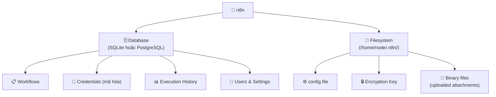
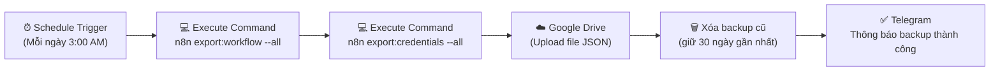

> [!nav] Điều hướng
> **Mục lục:** [[index|🏠 Wiki N8N - Trang chủ]]
> **Bài trước:** [[25-Cấu hình HTTPS Reverse Proxy Nginx và Cloudflare Tunnel]]
> **Bài tiếp theo:** [[06-Phân biệt Trigger Node và Action Node]]


# 🔄 Backup & Restore dữ liệu n8n

> [!info] Tổng quan
> Workflows, credentials, executions — tất cả dữ liệu của bạn trong n8n có thể mất trong nháy mắt nếu server gặp sự cố. **Backup định kỳ** là bước không thể bỏ qua cho bất kỳ hệ thống production nào. Bài này hướng dẫn toàn bộ chiến lược backup và cách restore khi cần.

---

## 🗂️ n8n lưu trữ dữ liệu ở đâu?



> [!caution] Encryption Key — Quan trọng nhất!
> File `~/.n8n/config` chứa **encryption key** — khóa mã hóa toàn bộ credentials. Nếu mất file này, **mọi credential sẽ không thể giải mã được**, kể cả khi bạn có bản backup database. Hãy backup file này trước tiên và lưu ở nơi an toàn riêng biệt.

---

## 📦 Phương pháp 1: Backup thủ công (SQLite)

Dành cho n8n chạy với **SQLite** (mặc định khi không cấu hình database).

### Backup

```bash
# Dừng n8n để tránh corrupt
docker compose down

# Backup toàn bộ thư mục .n8n
tar -czf n8n-backup-$(date +%Y%m%d).tar.gz ~/.n8n/

# Hoặc chỉ backup file database
cp ~/.n8n/database.sqlite ~/backups/n8n-db-$(date +%Y%m%d).sqlite

# Khởi động lại n8n
docker compose up -d
```

### Restore

```bash
# Dừng n8n
docker compose down

# Giải nén backup
tar -xzf n8n-backup-20240127.tar.gz -C ~/

# Khởi động lại
docker compose up -d
```

---

## 🐘 Phương pháp 2: Backup PostgreSQL

Dành cho n8n dùng **PostgreSQL** (recommended cho production).

### Backup database

```bash
# Backup toàn bộ database n8n
pg_dump -U n8n_user -d n8n_db > n8n-pg-backup-$(date +%Y%m%d-%H%M).sql

# Nếu dùng Docker
docker exec postgres-container pg_dump -U n8n_user n8n_db > n8n-pg-backup-$(date +%Y%m%d).sql

# Nén để tiết kiệm dung lượng
gzip n8n-pg-backup-*.sql
```

### Restore database

```bash
# Tạo lại database (nếu cần)
psql -U postgres -c "CREATE DATABASE n8n_db;"
psql -U postgres -c "CREATE USER n8n_user WITH PASSWORD 'yourpassword';"
psql -U postgres -c "GRANT ALL ON DATABASE n8n_db TO n8n_user;"

# Restore từ backup
gunzip -c n8n-pg-backup-20240127.sql.gz | psql -U n8n_user -d n8n_db
```

---

## ⚙️ Phương pháp 3: Xuất Workflows qua n8n CLI (Khuyến nghị)

n8n có **built-in CLI** để export/import workflows và credentials — không phụ thuộc vào loại database.

### Xuất (Export)

```bash
# Export tất cả workflows ra file JSON
n8n export:workflow --all --output=./backups/workflows-$(date +%Y%m%d).json

# Export tất cả credentials (đã mã hóa)
n8n export:credentials --all --output=./backups/credentials-$(date +%Y%m%d).json

# Nếu dùng Docker
docker exec n8n-container n8n export:workflow --all --output=/backups/workflows.json
```

### Nhập (Import)

```bash
# Import workflows
n8n import:workflow --input=./backups/workflows-20240127.json

# Import credentials
n8n import:credentials --input=./backups/credentials-20240127.json
```

---

## 🤖 Tự động hóa Backup với n8n Workflow

> Dùng chính n8n để tự backup n8n! 🪄



**Script backup tự động:**

```bash
#!/bin/bash
# Lưu file này tại: /home/user/backup-n8n.sh
# Thêm vào crontab: 0 3 * * * /home/user/backup-n8n.sh

DATE=$(date +%Y%m%d-%H%M)
BACKUP_DIR="/home/user/n8n-backups"
mkdir -p "$BACKUP_DIR"

# Export workflows và credentials
docker exec n8n n8n export:workflow --all --output="/backup/workflows-$DATE.json"
docker exec n8n n8n export:credentials --all --output="/backup/credentials-$DATE.json"

# Nén toàn bộ
tar -czf "$BACKUP_DIR/n8n-full-$DATE.tar.gz" -C /home/user/.n8n .

# Xóa backup cũ hơn 30 ngày
find "$BACKUP_DIR" -name "*.tar.gz" -mtime +30 -delete

echo "✅ Backup n8n hoàn tất: $DATE"
```

---

## 🚨 Checklist Backup cho Production

| Hạng mục | Tần suất | Phương pháp | Nơi lưu |
|---|---|---|---|
| **Encryption Key** | 1 lần (lưu mãi) | Copy thủ công | Password Manager |
| **Workflows** | Hàng ngày | n8n CLI export | Google Drive / S3 |
| **Credentials** | Hàng ngày | n8n CLI export | Google Drive / S3 |
| **Database dump** | Hàng ngày | pg_dump / sqlite | Remote storage |
| **Full .n8n folder** | Hàng tuần | tar.gz | Remote storage |

---

## 🔄 Kịch bản Restore hoàn chỉnh (Disaster Recovery)

```bash
# Bước 1: Cài đặt n8n mới trên server mới
docker compose up -d

# Bước 2: Restore encryption key TRƯỚC TIÊN
cp backup/config ~/.n8n/config
docker compose restart

# Bước 3: Import workflows
docker exec n8n n8n import:workflow --input=/backup/workflows.json

# Bước 4: Import credentials
docker exec n8n n8n import:credentials --input=/backup/credentials.json

# Bước 5: Kiểm tra
# - Truy cập n8n UI
# - Kiểm tra workflows có đủ không
# - Test 1-2 workflow quan trọng
# - Kiểm tra credentials có kết nối được không
```

> [!tip] Test restore định kỳ
> Backup vô nghĩa nếu bạn chưa bao giờ thử restore. Mỗi tháng một lần, hãy thử restore vào một môi trường test để chắc chắn backup của bạn thực sự hoạt động.

---

> [!nav] Điều hướng
> **Bài trước:** [[25-Cấu hình HTTPS Reverse Proxy Nginx và Cloudflare Tunnel]]
> **Bài tiếp theo:** [[06-Phân biệt Trigger Node và Action Node]]
