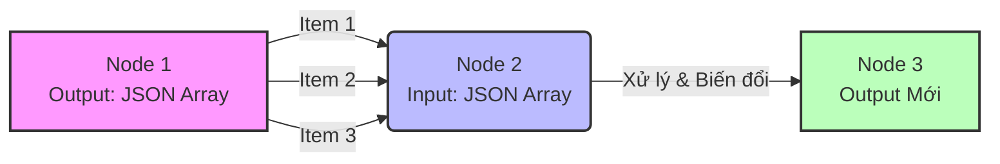
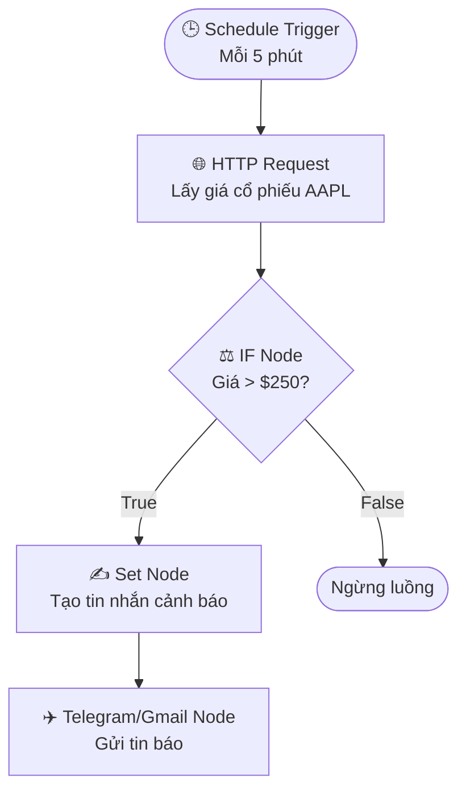

> [!nav] Điều hướng
> **Tới trang chủ:** [[index|Wiki N8N Automation]]
> **Bài trước:** [[07-Trigger Nodes & Action trong App Nodes]]
> **Bài tiếp theo:** [[09-Tìm hiểu các định dạng Dữ liệu trong n8n - JSON và Binary]]

# Core Nodes & Nguyên tắc Dataflow trong n8n

> [!info] Mục tiêu
> Trong bài học này, chúng ta sẽ tìm hiểu về **Core Nodes** (Các Node Cốt Lõi) và **Nguyên tắc Dataflow** (Logic vận hành Dữ liệu). 
> - **Core Nodes**: Những công cụ nền tảng giúp workflow của bạn tương tác với thế giới bên ngoài thông qua API và thực thi các hành động ở cấp độ hệ thống.
> - **Dataflow**: Việc nắm vững các nguyên tắc này sẽ giúp bạn hiểu rõ cách dữ liệu di chuyển và được xử lý qua từng bước trong n8n, chìa khóa để xây dựng các workflow chính xác và hiệu quả.

---

## 1. Core Nodes - Các Node cốt lõi

Core Nodes là các công cụ nền tảng cho phép workflow thực thi các hành động cốt lõi và kết nối với các dịch vụ khác không có sẵn node tích hợp.

### 1.1. HTTP Request Node
- **Mục đích**: Đây là công cụ vạn năng nhất để kết nối workflow của bạn với thế giới bên ngoài. Bạn có thể dùng nó để giao tiếp với hầu hết mọi API trên internet để lấy thông tin (ví dụ: dùng phương thức GET) hoặc gửi dữ liệu đi (ví dụ: dùng phương thức POST).
- **Ví dụ thực tế**: Tự động kiểm tra giá của một mã cổ phiếu (ví dụ: AAPL của Apple) từ một dịch vụ cung cấp dữ liệu tài chính như Alpha Vantage.
    - Bạn sẽ cung cấp URL của API.
    - Thiết lập các tham số cần thiết như mã cổ phiếu, khóa API, v.v.
    - Node sẽ gửi yêu cầu và nhận về dữ liệu giá cổ phiếu mới nhất.

### 1.2. Execute Command Node
- **Mục đích**: Cho phép bạn tương tác trực tiếp với hệ điều hành của máy chủ đang chạy n8n. Node này có thể thực thi các dòng lệnh (command-line scripts) để thao tác với file hệ thống, chạy các chương trình tùy chỉnh, hoặc thực hiện các tác vụ quản trị.
- **Lưu ý quan trọng**:
    - Node này **chỉ có trên phiên bản n8n tự host (self-hosted)**, không có trên n8n Cloud vì lý do bảo mật.
    - Đây là một node rất mạnh nhưng cũng tiềm ẩn rủi ro, chỉ nên sử dụng khi bạn hoàn toàn chắc chắn về lệnh mình đang chạy.

### 1.3. Wait Node
- **Mục đích**: Tạm dừng workflow trong một khoảng thời gian nhất định hoặc cho đến khi một điều kiện cụ thể được đáp ứng.
- **Chức năng**:
    - Tạo độ trễ giữa các hành động để tránh gửi yêu cầu quá nhanh đến các API.
    - Lên lịch cho các hành động tiếp theo, ví dụ như gửi email nhắc nhở sau 5 phút.
- **Lưu ý**: Nếu thời gian chờ quá lâu (ví dụ, hơn 1 phút), workflow sẽ "ngủ đông" để tiết kiệm tài nguyên và sẽ tự động "thức dậy" khi đến giờ hoặc có sự kiện kích hoạt.
- **Ví dụ**: Sau khi lấy giá cổ phiếu bằng HTTP Request Node, workflow có thể chờ 5 phút trước khi thực hiện hành động tiếp theo.

---

## 2. Nguyên tắc Dataflow - Logic vận hành của n8n

Dataflow là logic cốt lõi quy định cách dữ liệu được truyền và xử lý tuần tự qua từng node, đảm bảo mỗi bước đều nhận và thao tác trên kết quả của bước ngay trước nó.

### 2.1. Items
- **Bản chất**: Dữ liệu trong n8n được cấu trúc thành các "item". Mỗi item là một đơn vị dữ liệu riêng lẻ, thường ở dạng một đối tượng JSON (object). Ví dụ: mỗi đơn hàng, mỗi thông tin khách hàng là một item.
- **Luôn là một mảng (Array)**: Dù workflow chỉ xử lý một item duy nhất, dữ liệu vẫn luôn được lưu trữ dưới dạng một mảng các item. Đây là một nguyên tắc cơ bản cần nhớ.

### 2.2. Expressions {{ }}
- **Mục đích**: Expressions là một cơ chế cực kỳ mạnh mẽ cho phép bạn truy cập, tính toán và biến đổi dữ liệu một cách linh động ngay trong các trường của một node. Chúng luôn được đặt trong cặp dấu ngoặc nhọn kép `{{...}}`.
- **Ứng dụng**:
    - **Lấy dữ liệu từ node trước**: `{{ $json.email }}` sẽ lấy giá trị của trường "email" từ dữ liệu đầu vào.
    - **Ghép nối và tạo nội dung động**: `{{ 'Xin chào ' + $json.name }}` sẽ tạo ra một chuỗi chào hỏi được cá nhân hóa.
    - **Thực hiện phép tính và logic**: Bạn có thể thực hiện các phép toán hoặc chuyển đổi định dạng trực tiếp bên trong expression.

### 2.3. Data Mapping
- **Nguyên tắc**: Mỗi node trong workflow chỉ có thể "nhìn thấy" và xử lý dữ liệu mà nó nhận được trực tiếp từ node phía trước.
- **Cách kết nối**: Dữ liệu có thể được ánh xạ (map) từ node này sang node khác bằng cách kéo-thả, sử dụng expressions, hoặc để n8n tự động kết nối.

---

## 3. Workflow Thực Tế: Cảnh Báo Giá Cổ Phiếu

- **Mục tiêu**: Xây dựng một workflow tự động kiểm tra giá của một mã cổ phiếu. Nếu giá vượt qua một ngưỡng nhất định, hệ thống sẽ ghi lại sự kiện và chuẩn bị một thông báo để gửi đi.
- **Luồng hoạt động**:
    1. **HTTP Request Node**: Gọi đến một API tài chính để lấy giá cổ phiếu hiện tại.
    2. **If Node**: So sánh giá vừa lấy được với một ngưỡng giá đã định trước.
    3. **Set Node**: Nếu giá vượt ngưỡng, node này sẽ tạo ra nội dung của tin nhắn cảnh báo (ví dụ: "Cảnh báo: Giá cổ phiếu AAPL đã vượt ngưỡng $250!").
    4. **Node tiếp theo**: Một node thông báo như Telegram hoặc Gmail sẽ gửi đi nội dung đã được chuẩn bị ở bước trên.

---

## 4. Tổng kết & Lưu ý

> [!check] Tổng kết
> - **HTTP Request Node** là "cửa ngõ" để giao tiếp với các dịch vụ bên ngoài; việc hiểu cách xử lý dữ liệu trả về (response data) từ nó là rất quan trọng.
> - **Execute Command Node** rất mạnh nhưng cần được sử dụng một cách cẩn trọng để đảm bảo an toàn cho hệ thống của bạn.
> - **Wait Node** giúp điều tiết tốc độ của workflow, tránh việc xử lý quá nhanh gây ra lỗi hoặc bị giới hạn bởi các dịch vụ khác.
> - Hãy luôn ghi nhớ các nguyên tắc Dataflow: Dữ liệu luôn là một mảng các item, Expressions mang lại sự linh hoạt, và Data Mapping chính xác là yếu tố đảm bảo workflow hoạt động đúng đắn.

---

> [!nav] Điều hướng
> **Bài trước:** [[07-Trigger Nodes & Action trong App Nodes]]
> **Bài tiếp theo:** [[09-Tìm hiểu các định dạng Dữ liệu trong n8n - JSON và Binary]]
