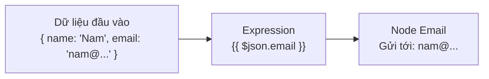

> [!nav] Điều hướng
> **Mục lục:** [[index|🏠 Wiki N8N - Trang chủ]]
> **Bài trước:** [[11-Quản lí Credential (Thông tin xác thực)]]
> **Bài tiếp theo:** [[15-Node HTTP Request - Gọi bất kỳ API nào]]


# 💻 Sử dụng Expressions & Formulas trong n8n

> [!info] Tổng quan
> **Expressions** là "ngôn ngữ bí mật" của n8n — cho phép bạn truy cập dữ liệu động, biến đổi giá trị, và thực hiện tính toán ngay bên trong các trường cấu hình node. Đây là kỹ năng giúp workflow của bạn trở nên **thực sự linh hoạt và thông minh**.

## 🎯 Tại sao cần Expression?

Hầu hết các node cho phép bạn nhập **giá trị tĩnh (static)** — ví dụ luôn gửi email đến `cố định@gmail.com`. Nhưng trong thực tế, bạn cần giá trị **động (dynamic)** — lấy email của người dùng từ dữ liệu đầu vào.

Expression giải quyết điều đó.



---

## 🔤 Cú pháp Expression cơ bản

Mọi expression trong n8n đều được đặt trong dấu `{{ }}`.

| Mẫu Expression | Ý nghĩa |
|---|---|
| `{{ $json.fieldName }}` | Lấy trường `fieldName` từ item hiện tại |
| `{{ $json.user.email }}` | Truy cập field lồng nhau (nested) |
| `{{ $json.price * 1.1 }}` | Tính toán số học |
| `{{ $json.name.toUpperCase() }}` | Dùng hàm JavaScript |
| `{{ $now.toISO() }}` | Lấy thời gian hiện tại |

---

## 🧰 Các biến đặc biệt (Built-in Variables)

n8n cung cấp sẵn các biến toàn cục để dùng trong expression:

| Biến | Mô tả |
|---|---|
| `$json` | Dữ liệu JSON của item hiện tại |
| `$binary` | Dữ liệu binary của item hiện tại |
| `$now` | Thời gian hiện tại (dạng DateTime) |
| `$today` | Ngày hôm nay |
| `$itemIndex` | Chỉ số (index) của item trong batch |
| `$runIndex` | Lần chạy thứ mấy (trong vòng lặp) |
| `$node["Tên Node"].json` | Lấy output của node khác theo tên |
| `$workflow.id` | ID của workflow đang chạy |
| `$execution.id` | ID của lần thực thi này |

---

## 🛠️ Ví dụ thực tế

### 1. Ghép chuỗi (String Concatenation)
```
{{ "Chào " + $json.firstName + " " + $json.lastName + "!" }}
```
→ *Kết quả:* `Chào Nguyễn Nam!`

### 2. Kiểm tra điều kiện (Ternary)
```
{{ $json.score >= 8 ? "Xuất sắc" : "Cần cố gắng thêm" }}
```

### 3. Định dạng ngày tháng
```
{{ $now.format("DD/MM/YYYY HH:mm") }}
```

### 4. Lấy dữ liệu từ node khác
```
{{ $node["HTTP Request"].json.data.userId }}
```

### 5. Lọc và xử lý mảng
```
{{ $json.items.filter(i => i.active).length }}
```

---

## 📚 Hàm chuỗi thông dụng

| Hàm | Ví dụ | Kết quả |
|---|---|---|
| `.toUpperCase()` | `"hello".toUpperCase()` | `HELLO` |
| `.toLowerCase()` | `"HELLO".toLowerCase()` | `hello` |
| `.trim()` | `" hello ".trim()` | `hello` |
| `.includes("x")` | `"n8n".includes("8")` | `true` |
| `.replace("a","b")` | `"ban".replace("a","o")` | `bon` |
| `.split(",")` | `"a,b,c".split(",")` | `["a","b","c"]` |

---

## 💡 Mẹo nâng cao

> [!tip] Sử dụng Expression Editor
> Nhấn vào biểu tượng ⚡ bên cạnh bất kỳ trường nào trong n8n để mở **Expression Editor** — nơi bạn có thể gõ expression và xem kết quả preview ngay lập tức trước khi chạy workflow.

> [!warning] JavaScript thuần — không phải n8n-only
> Mọi thứ trong `{{ }}` đều là **JavaScript thuần túy**. Bạn có thể dùng tất cả các phương thức JS tiêu chuẩn (string, array, math, date...).

---

> [!nav] Điều hướng
> **Bài trước:** [[11-Quản lí Credential (Thông tin xác thực)]]
> **Bài tiếp theo:** [[15-Node HTTP Request - Gọi bất kỳ API nào]]
