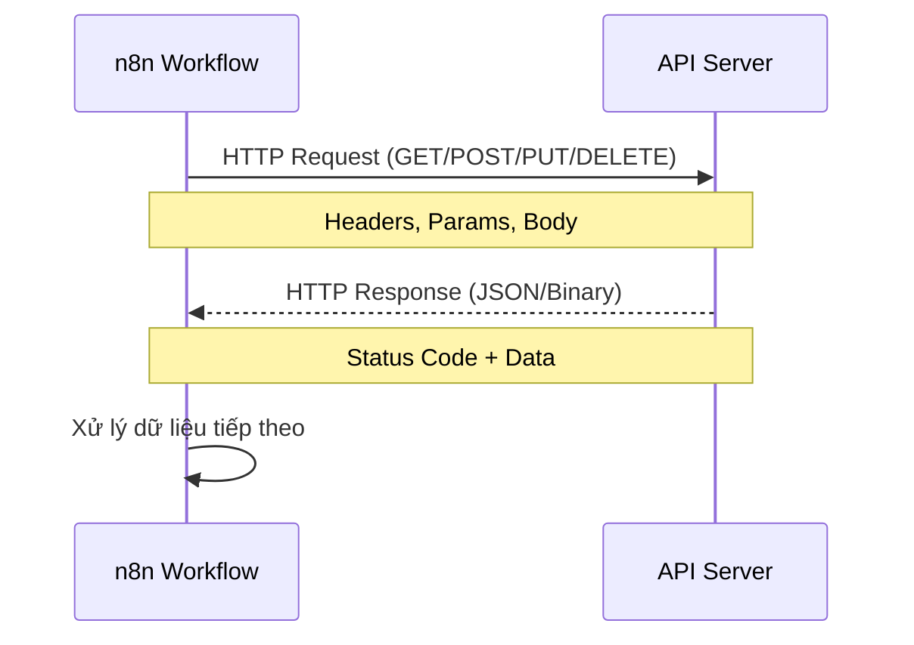

> [!nav] Điều hướng
> **Mục lục:** [[index|🏠 Wiki N8N - Trang chủ]]
> **Bài trước:** [[14-Sử dụng Expressions và Formulas trong n8n]]
> **Bài tiếp theo:** [[16-Node Code - Viết code tùy chỉnh JavaScript Python]]


# 🌐 Node HTTP Request — Gọi bất kỳ API nào

> [!info] Tổng quan
> **HTTP Request** là node mạnh mẽ nhất trong n8n. Nó cho phép bạn giao tiếp với **bất kỳ REST API nào trên thế giới** — từ nội bộ đến công khai, từ đơn giản đến OAuth phức tạp. Nếu một dịch vụ nào đó n8n chưa có node tích hợp sẵn, HTTP Request là giải pháp "vạn năng".

---

## 🔄 Luồng giao tiếp API



---

## ⚙️ Cấu hình cơ bản

### Các trường chính cần thiết lập:

| Trường | Mô tả | Ví dụ |
|---|---|---|
| **Method** | Phương thức HTTP | `GET`, `POST`, `PUT`, `DELETE`, `PATCH` |
| **URL** | Địa chỉ API endpoint | `https://api.example.com/users` |
| **Authentication** | Kiểu xác thực | None, Basic Auth, Header Auth, OAuth2 |
| **Headers** | Tiêu đề HTTP | `Content-Type: application/json` |
| **Query Parameters** | Tham số trên URL | `?page=1&limit=10` |
| **Body** | Dữ liệu gửi lên (POST/PUT) | JSON, Form Data, Binary |

---

## 📌 Các kiểu xác thực (Authentication)

### 1. API Key qua Header
```
Header Name: Authorization
Header Value: Bearer YOUR_API_KEY
```

### 2. Basic Auth
```
Username: your_user
Password: your_password
```

### 3. OAuth2
n8n hỗ trợ OAuth2 trực tiếp — chỉ cần chọn loại OAuth2 và điền Client ID/Secret, n8n sẽ tự xử lý token refresh.

---

## 🧪 Ví dụ thực tế

### Ví dụ 1: GET — Lấy danh sách posts từ JSONPlaceholder
- **Method:** `GET`
- **URL:** `https://jsonplaceholder.typicode.com/posts`

Kết quả trả về là mảng JSON với 100 bài post, mỗi bài có `id`, `title`, `body`, `userId`.

---

### Ví dụ 2: POST — Tạo một record mới
- **Method:** `POST`
- **URL:** `https://api.example.com/contacts`
- **Body (JSON):**
```json
{
  "name": "{{ $json.name }}",
  "email": "{{ $json.email }}",
  "source": "n8n-automation"
}
```

---

### Ví dụ 3: Gọi API động — URL thay đổi theo dữ liệu
```
URL: https://api.example.com/users/{{ $json.userId }}/orders
```
→ URL sẽ tự động thay `userId` bằng giá trị thực từ dữ liệu đầu vào.

---

## 🛡️ Xử lý lỗi API thường gặp

| Mã lỗi | Ý nghĩa | Hướng xử lý |
|---|---|---|
| `401 Unauthorized` | Sai/hết hạn API Key | Kiểm tra lại credential |
| `403 Forbidden` | Không có quyền truy cập | Kiểm tra permissions của API key |
| `404 Not Found` | Endpoint không tồn tại | Kiểm tra lại URL |
| `429 Too Many Requests` | Vượt rate limit | Thêm delay hoặc dùng Batching |
| `500 Server Error` | Lỗi phía server API | Thử lại sau, hoặc kiểm tra body request |

> [!tip] Bật "Continue on Fail"
> Trong Settings của node, bật **Continue on Fail** để workflow không dừng lại khi một API call thất bại. Bạn có thể dùng **IF Node** để kiểm tra và xử lý lỗi riêng.

---

## 📦 Phân trang (Pagination)

n8n HTTP Request hỗ trợ **tự động phân trang** — tự động gọi nhiều trang và gộp kết quả:

1. Bật tính năng **Pagination** trong cài đặt node.
2. Cấu hình điều kiện dừng (ví dụ: khi trường `next_page` là null).
3. Chỉ định cách lấy page token từ response.

---

> [!nav] Điều hướng
> **Bài trước:** [[14-Sử dụng Expressions và Formulas trong n8n]]
> **Bài tiếp theo:** [[16-Node Code - Viết code tùy chỉnh JavaScript Python]]
