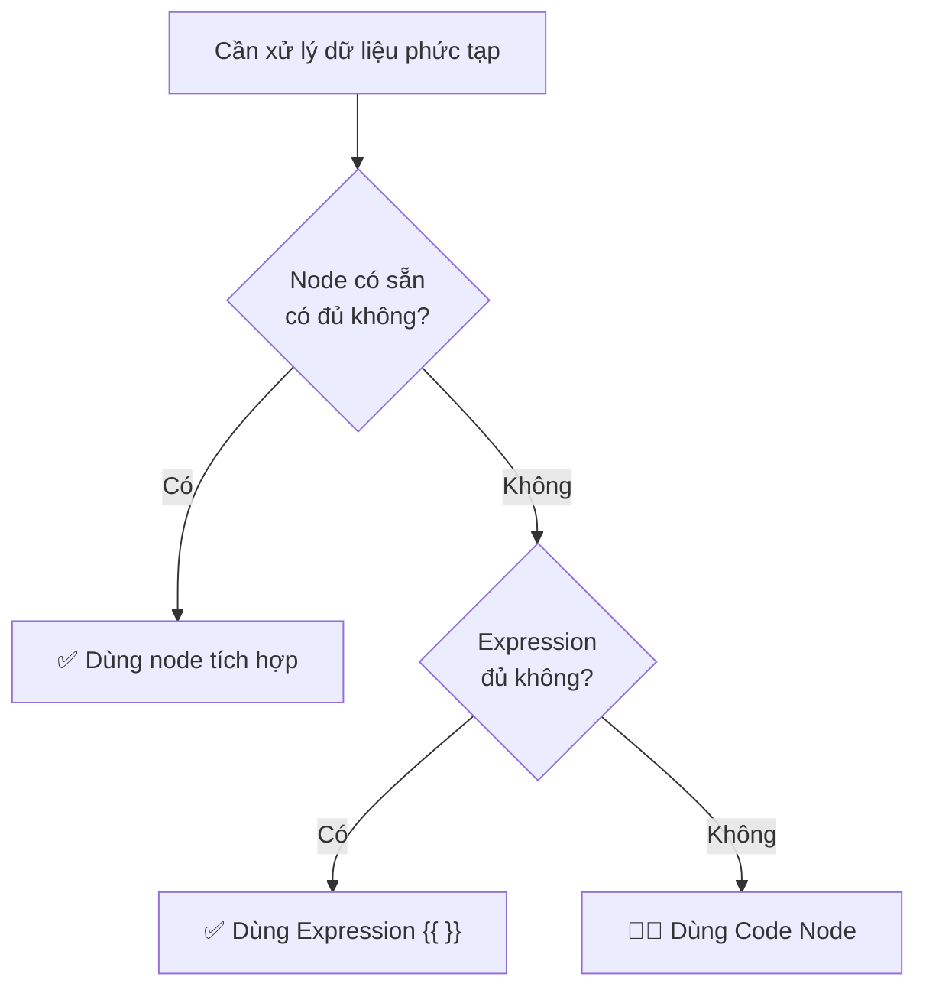

> [!nav] Điều hướng
> **Mục lục:** [[index|🏠 Wiki N8N - Trang chủ]]
> **Bài trước:** [[15-Node HTTP Request - Gọi bất kỳ API nào]]
> **Bài tiếp theo:** [[17-Error Handling - Bắt lỗi và xử lý ngoại lệ]]


# 🧑‍💻 Node Code — Viết code tùy chỉnh JavaScript/Python

> [!info] Tổng quan
> Khi các node có sẵn không đủ sức xử lý logic phức tạp, **Code Node** là "vũ khí hạng nặng" cuối cùng. Bạn có thể viết code **JavaScript hoặc Python** thuần túy để thực hiện bất kỳ phép biến đổi dữ liệu nào bạn muốn.

---

## 🤔 Khi nào nên dùng Code Node?



**Các tình huống cần Code Node:**
- Xử lý chuỗi phức tạp (regex, parse, format)
- Tính toán thuật toán tùy chỉnh
- Biến đổi cấu trúc dữ liệu phức tạp
- Gộp nhiều field thành một object mới
- Lọc/sắp xếp mảng theo điều kiện phức tạp

---

## 📋 Cấu trúc cơ bản

### JavaScript Mode

```javascript
// Nhận toàn bộ items từ node trước
const items = $input.all();

// Xử lý từng item
for (const item of items) {
  // Đọc dữ liệu
  const name = item.json.name;
  const price = item.json.price;
  
  // Thêm field mới
  item.json.priceWithTax = price * 1.1;
  item.json.displayName = name.toUpperCase();
}

// Bắt buộc return items
return items;
```

### Python Mode

```python
# Nhận toàn bộ items
items = _input.all()

# Xử lý từng item
for item in items:
    name = item.json["name"]
    price = item.json["price"]
    
    # Thêm field mới
    item.json["price_with_tax"] = price * 1.1
    item.json["display_name"] = name.upper()

# Bắt buộc return items
return items
```

---

## 🔑 Các biến có sẵn trong Code Node

| Biến | Mô tả |
|---|---|
| `$input.all()` | Lấy tất cả items từ node trước |
| `$input.first()` | Lấy item đầu tiên |
| `$input.last()` | Lấy item cuối cùng |
| `$input.item` | Item hiện tại (khi chạy "Run Once per Item") |
| `$node["Name"].all()` | Lấy output của node cụ thể theo tên |
| `$workflow.id` | ID của workflow |
| `$execution.id` | ID của lần thực thi |
| `$now` | DateTime hiện tại |

---

## 💡 Ví dụ thực tế

### 1. Tính tuổi từ ngày sinh
```javascript
const items = $input.all();

for (const item of items) {
  const birthDate = new Date(item.json.birthdate);
  const today = new Date();
  const age = today.getFullYear() - birthDate.getFullYear();
  item.json.age = age;
}

return items;
```

### 2. Nhóm dữ liệu theo category
```javascript
const items = $input.all();
const grouped = {};

for (const item of items) {
  const cat = item.json.category;
  if (!grouped[cat]) grouped[cat] = [];
  grouped[cat].push(item.json.name);
}

// Trả về dạng 1 item chứa toàn bộ nhóm
return [{ json: grouped }];
```

### 3. Lọc chỉ lấy email hợp lệ
```javascript
const items = $input.all();
const emailRegex = /^[^\s@]+@[^\s@]+\.[^\s@]+$/;

return items.filter(item => emailRegex.test(item.json.email));
```

---

## ⚠️ Lưu ý quan trọng

> [!warning] Bắt buộc phải return
> Code Node **phải** trả về dữ liệu. Nếu quên `return items`, node sẽ báo lỗi hoặc trả về mảng rỗng, khiến các node tiếp theo không có dữ liệu để xử lý.

> [!caution] Không có thư viện bên ngoài
> Code Node **không** hỗ trợ `import` hay `require` thư viện bên ngoài (như axios, lodash...). Chỉ dùng được JavaScript/Python built-in. Nếu cần gọi API, hãy dùng **HTTP Request Node**.

---

> [!nav] Điều hướng
> **Bài trước:** [[15-Node HTTP Request - Gọi bất kỳ API nào]]
> **Bài tiếp theo:** [[17-Error Handling - Bắt lỗi và xử lý ngoại lệ]]
