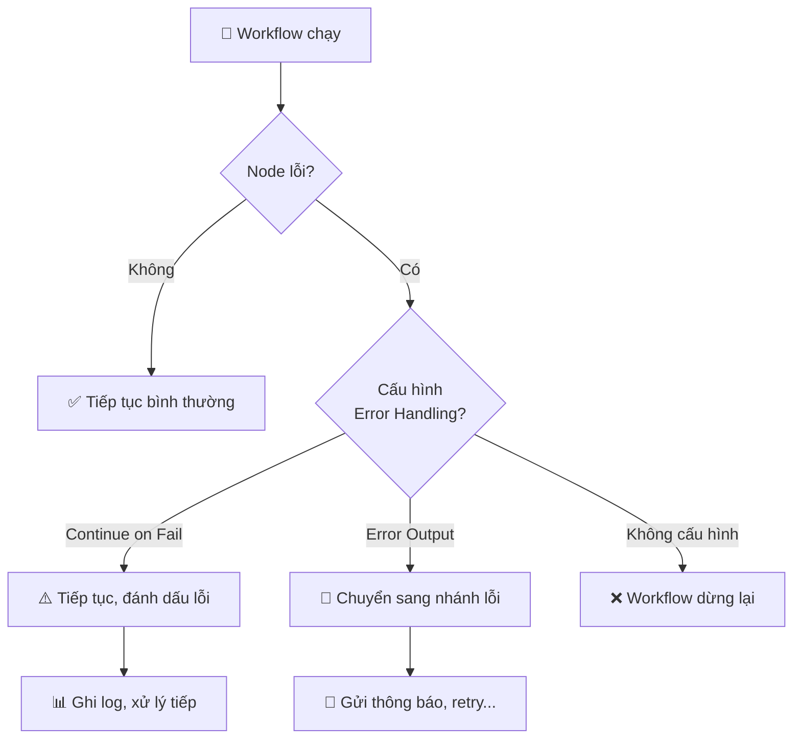
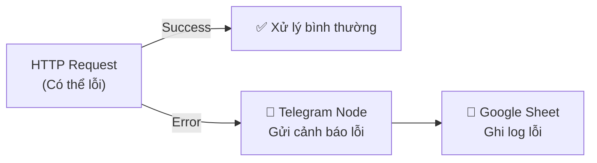

> [!nav] Điều hướng
> **Mục lục:** [[index|🏠 Wiki N8N - Trang chủ]]
> **Bài trước:** [[16-Node Code - Viết code tùy chỉnh JavaScript Python]]
> **Bài tiếp theo:** [[18-Execute Workflow Node - Thiết kế Sub-workflows]]


# 🛡️ Error Handling — Bắt lỗi và xử lý ngoại lệ

> [!info] Tổng quan
> Workflow trong môi trường production **luôn có thể gặp lỗi** — API bị timeout, dữ liệu không đúng format, credential hết hạn... **Error Handling** là kỹ năng giúp workflow của bạn **không bao giờ chết** mà thay vào đó tự xử lý linh hoạt và thông báo cho bạn biết khi có sự cố.

---

## 🗺️ Các tầng xử lý lỗi trong n8n



---

## 1️⃣ Continue on Fail (Tiếp tục khi lỗi)

**Cách bật:** Vào Settings của node → bật **Continue On Fail**

Khi được bật:
- Node lỗi sẽ **không dừng workflow**
- Item lỗi được đánh dấu với `error` property
- Bạn có thể dùng **IF Node** sau đó để kiểm tra và xử lý riêng

```javascript
// Kiểm tra item có lỗi không trong Code Node
const items = $input.all();
const errors = items.filter(i => i.error);
const success = items.filter(i => !i.error);
```

---

## 2️⃣ Error Output (Nhánh lỗi riêng)

Nhiều node (đặc biệt là HTTP Request) hỗ trợ **Error Output** — một đầu ra riêng biệt khi có lỗi.

**Cách dùng:**
1. Kết nối từ **đầu ra Error** của node (màu đỏ/cam) sang node xử lý khác
2. Node xử lý lỗi có thể là: Slack (gửi thông báo), Google Sheets (ghi log), Email...

---

## 3️⃣ Error Workflow (Workflow xử lý lỗi toàn cục)

n8n cho phép bạn chỉ định một **workflow riêng** để chạy khi bất kỳ workflow nào bị lỗi nghiêm trọng.

**Thiết lập:**
1. Vào **Settings** của workflow chính
2. Tìm **Error Workflow** → chọn workflow bạn tạo sẵn để xử lý lỗi
3. Workflow lỗi sẽ nhận được thông tin: tên workflow, node lỗi, thông báo lỗi, thời gian lỗi

---

## 📩 Ví dụ: Thông báo lỗi qua Telegram



**Nội dung message Telegram:**
```
⚠️ Lỗi Workflow!
Workflow: {{ $workflow.name }}
Node: {{ $node.name }}
Lỗi: {{ $json.error.message }}
Thời gian: {{ $now.format("DD/MM/YYYY HH:mm") }}
```

---

## 🔁 Retry (Thử lại tự động)

Trong Settings của node, bạn có thể bật **Retry on Fail**:
- **Max tries:** Số lần thử lại tối đa (ví dụ: 3)
- **Wait between tries:** Thời gian chờ giữa các lần (ví dụ: 5 giây)

Hữu ích với: API timeout, lỗi mạng tạm thời, rate limit...

---

## 📋 Checklist Error Handling cho Production

- [ ] Bật **Continue on Fail** cho các node có thể lỗi không nghiêm trọng
- [ ] Kết nối **Error Output** cho các node quan trọng (HTTP Request, DB...)
- [ ] Thiết lập **Error Workflow** toàn cục cho workflow quan trọng
- [ ] Thêm node **Telegram/Email/Slack** để nhận thông báo lỗi
- [ ] Ghi log lỗi vào **Google Sheets hoặc DB** để phân tích sau

---

> [!nav] Điều hướng
> **Bài trước:** [[16-Node Code - Viết code tùy chỉnh JavaScript Python]]
> **Bài tiếp theo:** [[18-Execute Workflow Node - Thiết kế Sub-workflows]]
