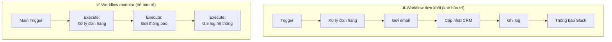
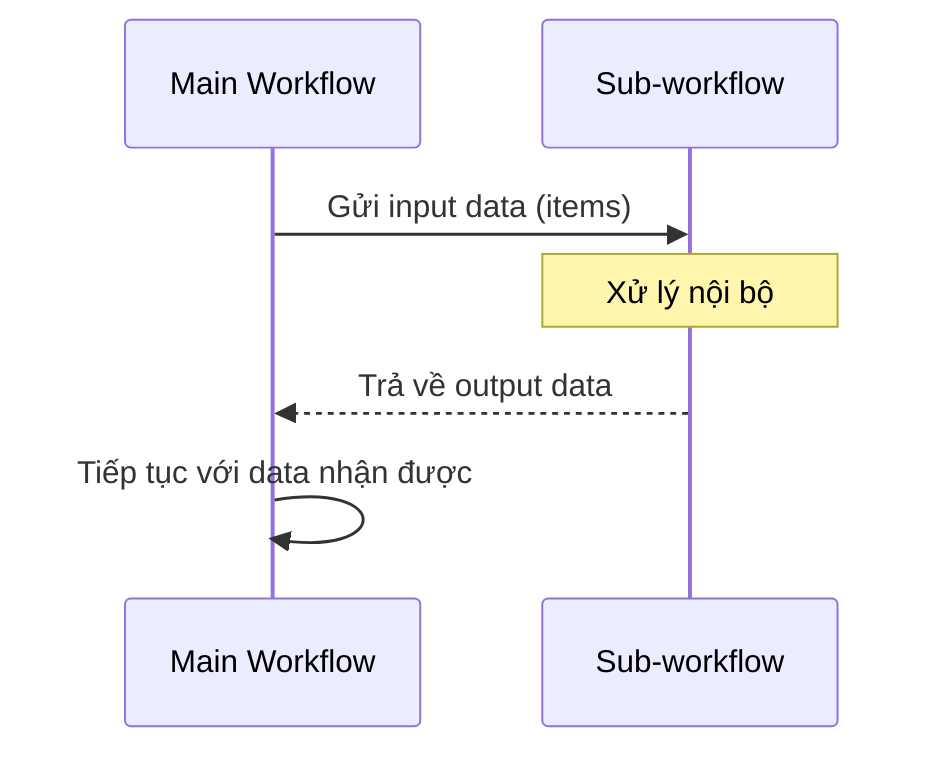

> [!nav] Điều hướng
> **Mục lục:** [[index|🏠 Wiki N8N - Trang chủ]]
> **Bài trước:** [[17-Error Handling - Bắt lỗi và xử lý ngoại lệ]]
> **Bài tiếp theo:** [[19-Webhooks - Nhận dữ liệu thời gian thực]]


# 🔁 Execute Workflow Node — Thiết kế Sub-workflows

> [!info] Tổng quan
> **Sub-workflow** là kỹ thuật tách workflow lớn thành các phần nhỏ, có thể tái sử dụng — giống như hàm (function) trong lập trình. Đây là chìa khóa để xây dựng hệ thống automation **có thể bảo trì và mở rộng** theo thời gian.

---

## 🏗️ Tại sao cần Sub-workflows?



**Lợi ích:**
- **Tái sử dụng:** Một sub-workflow có thể được gọi từ nhiều workflow khác
- **Dễ debug:** Test từng phần độc lập
- **Dễ bảo trì:** Sửa logic ở một chỗ, áp dụng toàn bộ hệ thống
- **Phân quyền:** Giao sub-workflow cho các thành viên team phụ trách

---

## ⚙️ Cách thiết lập Sub-workflow

### Bước 1: Tạo Sub-workflow
1. Tạo workflow mới
2. Chọn **Trigger** là **Execute Workflow Trigger** (thay vì Webhook hay Schedule)
3. Thiết kế logic xử lý của sub-workflow
4. Trả dữ liệu về bằng node cuối cùng

### Bước 2: Gọi Sub-workflow từ Workflow chính
1. Thêm node **Execute Workflow** vào workflow chính
2. Chọn **Workflow** mà bạn muốn gọi
3. Truyền dữ liệu đầu vào nếu cần

---

## 📨 Truyền dữ liệu vào và ra



**Trong Sub-workflow**, dữ liệu nhận vào được truy cập qua `$input` bình thường như mọi node khác.

---

## 🗂️ Ví dụ kiến trúc thực tế

### Hệ thống xử lý Lead (Khách hàng tiềm năng)

```
📌 Main Workflow
   ├── Trigger: Form đăng ký mới
   ├── Execute: "Validate Lead Data"       ← Sub-workflow 1
   ├── Execute: "Enrich Lead from Clearbit" ← Sub-workflow 2
   ├── Execute: "Add to CRM (HubSpot)"    ← Sub-workflow 3
   └── Execute: "Send Welcome Email"       ← Sub-workflow 4
```

Mỗi sub-workflow được tái sử dụng khi có lead đến từ các nguồn khác nhau (Webinar, Landing Page, Chat...).

---

## 📋 Best Practices

| Nên làm ✅ | Không nên ❌ |
|---|---|
| Đặt tên sub-workflow rõ ràng (động từ + danh từ) | Gộp tất cả logic vào 1 workflow lớn |
| Mỗi sub-workflow làm 1 việc duy nhất | Tạo sub-workflow lồng nhau quá nhiều tầng |
| Document input/output của mỗi sub-workflow | Truyền quá nhiều data không cần thiết |
| Test sub-workflow độc lập trước | Hardcode giá trị bên trong sub-workflow |

---

> [!tip] Ghi chú Input/Output
> Thêm node **Sticky Note** ở đầu và cuối mỗi sub-workflow để ghi rõ: **Input cần gì?** và **Output trả về gì?** — điều này giúp team của bạn hiểu ngay mà không cần đọc toàn bộ logic.

---

> [!nav] Điều hướng
> **Bài trước:** [[17-Error Handling - Bắt lỗi và xử lý ngoại lệ]]
> **Bài tiếp theo:** [[19-Webhooks - Nhận dữ liệu thời gian thực]]
