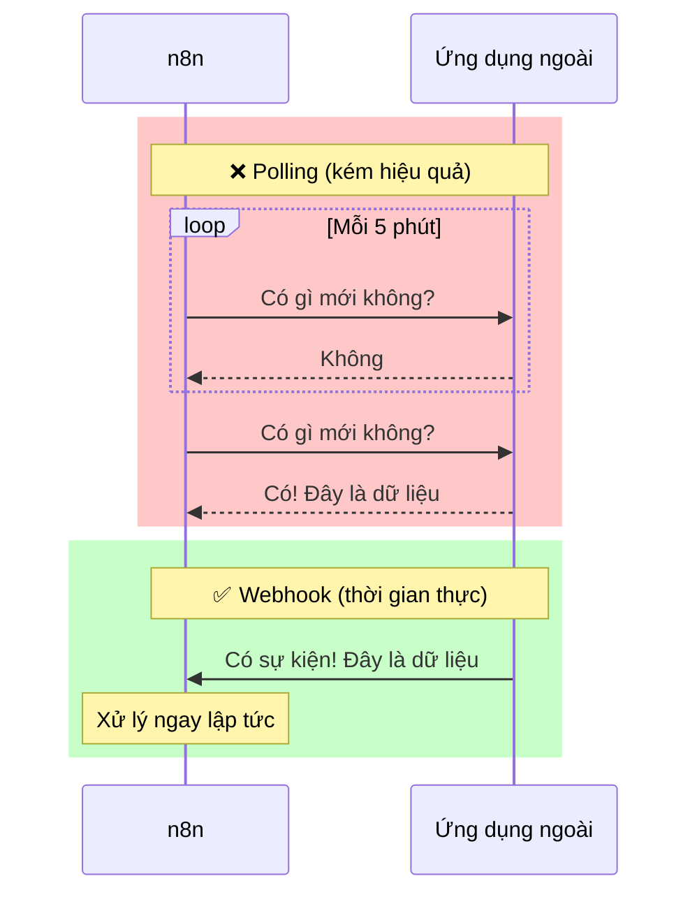
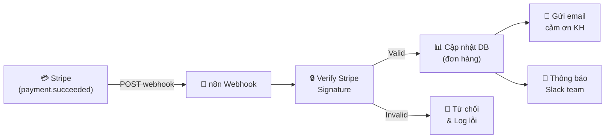

> [!nav] Điều hướng
> **Mục lục:** [[00-N8N 101 - Mục lục]]
> **Bài trước:** [[18-Execute Workflow Node - Thiết kế Sub-workflows]]
> **Bài tiếp theo:** [[20-Xử lý mảng Arrays Batching và Phân trang Pagination]]


# 🎣 Webhooks — Nhận dữ liệu thời gian thực

> [!info] Tổng quan
> **Webhook** là cơ chế để các ứng dụng bên ngoài **chủ động gửi dữ liệu** vào n8n ngay khi có sự kiện xảy ra — thay vì n8n phải liên tục hỏi "có gì mới không?". Đây là cách nhanh nhất và hiệu quả nhất để xây dựng automation **phản ứng real-time**.

---

## 🔄 Polling vs Webhook



---

## ⚙️ Thiết lập Webhook trong n8n

### Bước 1: Thêm Webhook Node
1. Tạo workflow mới
2. Thêm node **Webhook** làm trigger
3. Chọn **HTTP Method** (thường là `POST`)
4. Copy **Webhook URL** được tạo ra

### Bước 2: Đăng ký với ứng dụng ngoài
Dán URL webhook vào phần cài đặt của ứng dụng bên ngoài (Stripe, GitHub, Lark, Typeform...) để chúng biết nơi gửi dữ liệu.

### Bước 3: Test Webhook
- Nhấn **Listen for Test Event** trong n8n
- Trigger sự kiện từ ứng dụng ngoài
- n8n sẽ nhận và hiển thị dữ liệu để bạn kiểm tra

---

## 📥 Cấu trúc dữ liệu Webhook nhận được

Khi webhook nhận request, n8n cung cấp:

| Trường | Mô tả | Ví dụ |
|---|---|---|
| `$json.body` | Nội dung body của request | `{ "event": "payment.success", "amount": 100 }` |
| `$json.headers` | HTTP Headers của request | `{ "content-type": "application/json" }` |
| `$json.query` | Query parameters trên URL | `{ "token": "abc123" }` |
| `$json.params` | Path parameters | `{ "id": "user-123" }` |

---

## 🔒 Bảo mật Webhook

> [!warning] Webhook URL là công khai
> Bất kỳ ai có URL webhook đều có thể gửi request vào workflow của bạn. **Luôn xác thực nguồn gửi!**

**Các cách xác thực:**

### 1. Verify bằng Secret Token
```javascript
// Trong Code Node sau Webhook
const token = $json.headers["x-webhook-secret"];
if (token !== "your_secret_token") {
  throw new Error("Unauthorized webhook request!");
}
```

### 2. Verify bằng Signature (HMAC)
Nhiều dịch vụ (Stripe, GitHub) ký mỗi request bằng HMAC signature. Bạn cần verify signature này trước khi xử lý.

---

## 🌐 Ví dụ: Webhook nhận thông báo thanh toán Stripe



---

## 🔁 Respond to Webhook

n8n cho phép bạn **gửi phản hồi** ngay lập tức về ứng dụng đã gửi webhook:

- **Immediately:** Phản hồi ngay `200 OK` mà không cần chờ workflow hoàn thành
- **When Last Node Finishes:** Phản hồi sau khi toàn bộ workflow chạy xong, có thể trả về data
- **Using Respond to Webhook Node:** Tự chỉ định nội dung phản hồi (status code, body, headers)

---

> [!nav] Điều hướng
> **Bài trước:** [[18-Execute Workflow Node - Thiết kế Sub-workflows]]
> **Bài tiếp theo:** [[20-Xử lý mảng Arrays Batching và Phân trang Pagination]]
