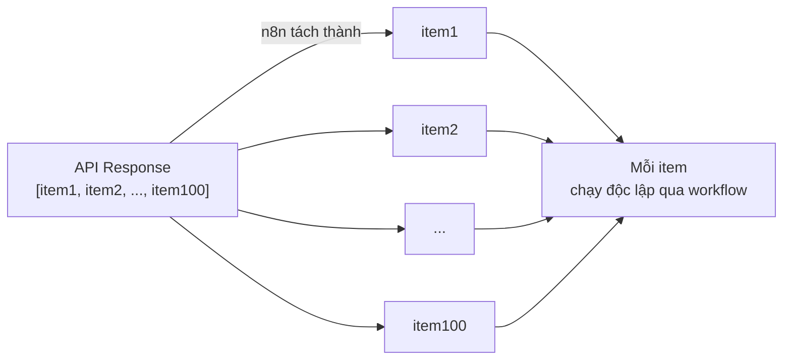
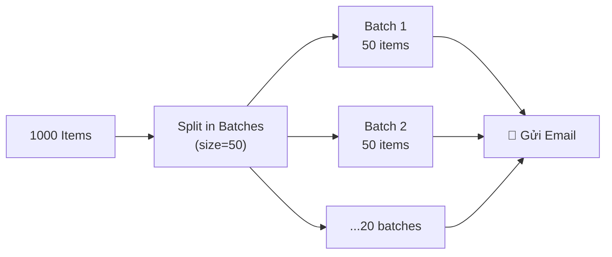

> [!nav] Điều hướng
> **Mục lục:** [[index|🏠 Wiki N8N - Trang chủ]]
> **Bài trước:** [[19-Webhooks - Nhận dữ liệu thời gian thực]]
> **Bài tiếp theo:** [[12-Vai trò của LLM trong Quy trình Tự động hóa]]


# 📦 Xử lý mảng (Arrays), Batching và Phân trang (Pagination)

> [!info] Tổng quan
> Trong thực tế, workflows thường phải xử lý **hàng trăm đến hàng nghìn items** — danh sách người dùng, đơn hàng, bản ghi... Bài này giúp bạn hiểu cách n8n xử lý dữ liệu số lượng lớn một cách hiệu quả thông qua kỹ thuật **Batching** và **Pagination**.

---

## 📋 n8n xử lý dữ liệu theo items



**Khái niệm cốt lõi:** Khi node trả về mảng (array), n8n tự động tách thành **từng item riêng lẻ** và xử lý song song. Đây là sức mạnh của n8n!

---

## 🗂️ Các thao tác với mảng trong Code Node

### Lọc mảng (Filter)
```javascript
const items = $input.all();
// Chỉ lấy đơn hàng có giá trị > 500k
return items.filter(i => i.json.amount > 500000);
```

### Sắp xếp mảng (Sort)
```javascript
const items = $input.all();
// Sắp xếp theo ngày tạo mới nhất lên đầu
return items.sort((a, b) => new Date(b.json.createdAt) - new Date(a.json.createdAt));
```

### Biến đổi mảng (Map)
```javascript
const items = $input.all();
// Thêm field mới vào mỗi item
return items.map(i => ({
  json: {
    ...i.json,
    fullName: `${i.json.firstName} ${i.json.lastName}`,
    processedAt: new Date().toISOString()
  }
}));
```

### Gộp nhiều items thành 1 (Reduce)
```javascript
const items = $input.all();
const totalRevenue = items.reduce((sum, i) => sum + i.json.amount, 0);
return [{ json: { totalRevenue, count: items.length } }];
```

---

## 🚦 Batching — Xử lý theo lô

**Vấn đề:** Gửi 1000 email cùng lúc có thể bị spam filter hoặc rate limit.  
**Giải pháp:** Chia thành **batch nhỏ** và gửi từng đợt.

### Cách 1: Dùng Split in Batches Node
1. Thêm **Split in Batches** node vào trước node xử lý
2. Cấu hình **Batch Size** (ví dụ: 10 items mỗi lần)
3. Tùy chọn thêm **Wait** node để delay giữa các batch



### Cách 2: Batching trong HTTP Request Node
HTTP Request có hỗ trợ **Pagination** tích hợp — tự động gọi nhiều trang và gộp kết quả:

| Cấu hình | Mô tả |
|---|---|
| **Pagination Mode** | `Off` / `Update a Parameter` / `Response Contains Next URL` |
| **Next Page URL** | Expression lấy URL trang tiếp từ response |
| **Stop Condition** | Điều kiện để dừng (VD: khi `next_page` là null) |
| **Max Pages** | Giới hạn số trang tối đa (tránh vòng lặp vô hạn) |

---

## 📖 Phân trang (Pagination) — Lấy đủ dữ liệu từ API

Hầu hết API giới hạn kết quả trả về mỗi lần (ví dụ: tối đa 100 bản ghi/page). Để lấy toàn bộ dữ liệu, cần gọi nhiều trang.

### Ví dụ: Lấy toàn bộ contacts từ HubSpot
```
Trang 1: /contacts?limit=100&after=0        → 100 contacts + next_cursor: "abc"
Trang 2: /contacts?limit=100&after=abc      → 100 contacts + next_cursor: "def"  
Trang 3: /contacts?limit=100&after=def      → 50 contacts + next_cursor: null (hết!)
```

**Cấu hình trong HTTP Request:**
- Pagination Mode: `Update a Parameter`
- Parameter to Update: `after` (query param)
- Value to Set: `{{ $response.body.paging.next.after }}`
- Stop Condition: `{{ $response.body.paging.next === undefined }}`

---

## ⚡ Mẹo tối ưu hiệu suất

> [!tip] Xử lý song song hay tuần tự?
> Mặc định n8n xử lý items **song song** (parallel). Nếu bạn cần xử lý **tuần tự** (sequential), bật **Execute Once** hoặc dùng **Split in Batches** với batch size = 1.

> [!caution] Cẩn thận với số lượng lớn
> Khi xử lý hàng chục nghìn items, hãy cân nhắc:
> - Thêm **Wait Node** giữa các batch để tránh rate limit
> - Sử dụng **Batching** thay vì xử lý tất cả cùng lúc
> - Monitor memory usage của n8n server

---

> [!nav] Điều hướng
> **Bài trước:** [[19-Webhooks - Nhận dữ liệu thời gian thực]]
> **Bài tiếp theo:** [[12-Vai trò của LLM trong Quy trình Tự động hóa]]
