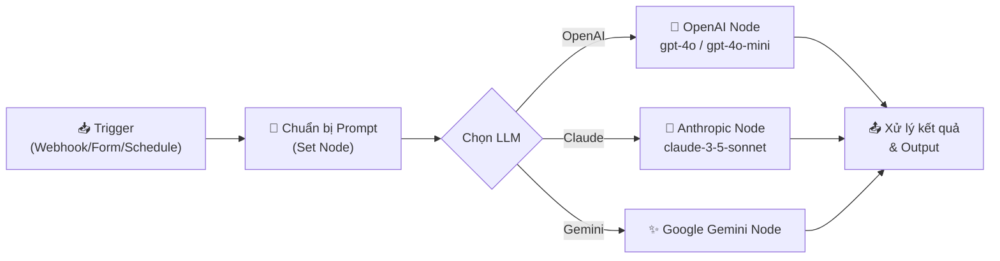
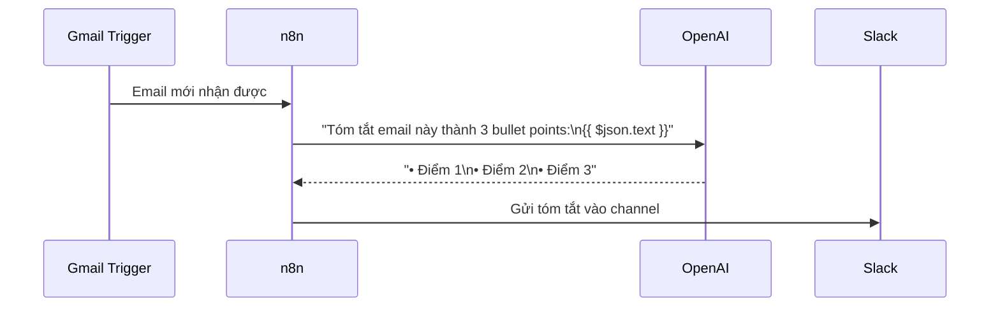

> [!nav] Điều hướng
> **Mục lục:** [[00-N8N 101 - Mục lục]]
> **Bài trước:** [[12-Vai trò của LLM trong Quy trình Tự động hóa]]
> **Bài tiếp theo:** [[22-Xây dựng AI Agent với các Tools tùy chỉnh]]


# 💬 Kết nối OpenAI (ChatGPT) / Anthropic (Claude) vào n8n

> [!info] Tổng quan
> n8n tích hợp sẵn các node cho **OpenAI**, **Anthropic Claude**, **Google Gemini** và nhiều LLM khác. Bài này hướng dẫn bạn thiết lập kết nối, gọi API và xây dựng những workflow AI đầu tiên của mình.

---

## 🏗️ Kiến trúc tổng quan



---

## 🔑 Bước 1: Thiết lập Credentials

### OpenAI
1. Vào [platform.openai.com](https://platform.openai.com) → **API Keys** → tạo key mới
2. Trong n8n: **Credentials** → **New** → tìm `OpenAI` → dán API Key vào

### Anthropic Claude
1. Vào [console.anthropic.com](https://console.anthropic.com) → **API Keys** → tạo key mới
2. Trong n8n: **Credentials** → **New** → tìm `Anthropic` → dán API Key vào

> [!tip] Bảo mật API Key
> Không bao giờ hardcode API Key trực tiếp vào node. Luôn sử dụng hệ thống **Credentials** của n8n — key được mã hóa và lưu trữ an toàn.

---

## ⚙️ Bước 2: Cấu hình OpenAI Node

### Các thao tác chính (Operations)

| Operation | Mô tả | Dùng khi nào |
|---|---|---|
| **Message a Model** | Gửi tin nhắn và nhận phản hồi | Chat, Q&A, phân tích |
| **Generate an Image** | Tạo ảnh với DALL-E | Tạo hình ảnh minh họa |
| **Transcribe a Recording** | Chuyển audio → text | Whisper STT |
| **Analyze Image** | Phân tích nội dung ảnh | Vision tasks |

### Cấu hình "Message a Model"

| Trường | Giá trị gợi ý | Ghi chú |
|---|---|---|
| **Model** | `gpt-4o-mini` | Rẻ, nhanh, đủ dùng cho hầu hết tasks |
| **Messages** | System + User message | System: định nghĩa vai trò AI |
| **Temperature** | `0.7` | 0=chắc chắn, 1=sáng tạo |
| **Max Tokens** | `2048` | Giới hạn độ dài phản hồi |

---

## 📝 Ví dụ thực tế

### 1. Workflow tóm tắt email tự động



**Prompt mẫu:**
```
System: Bạn là trợ lý tóm tắt email chuyên nghiệp. 
Luôn trả lời bằng tiếng Việt, ngắn gọn và súc tích.

User: Tóm tắt email sau thành 3 bullet points quan trọng nhất:
{{ $json.emailBody }}
```

---

### 2. Phân loại ticket hỗ trợ khách hàng

```
System: Phân loại yêu cầu hỗ trợ vào 1 trong các nhóm:
[billing, technical, general, urgent]
Chỉ trả về đúng 1 từ phân loại, không giải thích thêm.

User: {{ $json.ticketContent }}
```

Kết quả → dùng **Switch Node** để route ticket đến đúng team.

---

## 🆚 So sánh các Model phổ biến

| Model | Tốc độ | Chi phí | Điểm mạnh |
|---|---|---|---|
| `gpt-4o-mini` | ⚡ Rất nhanh | 💚 Rất rẻ | Tasks đơn giản, phân loại |
| `gpt-4o` | ⚡ Nhanh | 💛 Trung bình | Phân tích phức tạp, reasoning |
| `claude-3-5-sonnet` | ⚡ Nhanh | 💛 Trung bình | Viết nội dung, code generation |
| `claude-3-opus` | 🐢 Chậm hơn | 🔴 Đắt | Tasks đòi hỏi độ chính xác cao |

---

## 💡 Mẹo tối ưu chi phí

> [!tip] Prompt Engineering tiết kiệm token
> - **Ngắn gọn:** Mỗi token = tiền. Viết prompt súc tích.
> - **Few-shot examples:** Đưa 1-2 ví dụ mẫu thay vì giải thích dài dòng.
> - **gpt-4o-mini trước:** Thử với model nhỏ trước, chỉ dùng model lớn khi cần.
> - **Cache responses:** Nếu prompt giống nhau, lưu kết quả vào DB thay vì gọi lại API.

---

> [!nav] Điều hướng
> **Bài trước:** [[12-Vai trò của LLM trong Quy trình Tự động hóa]]
> **Bài tiếp theo:** [[22-Xây dựng AI Agent với các Tools tùy chỉnh]]
