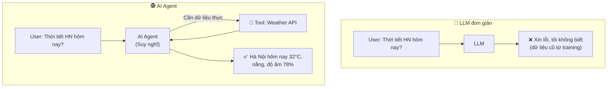
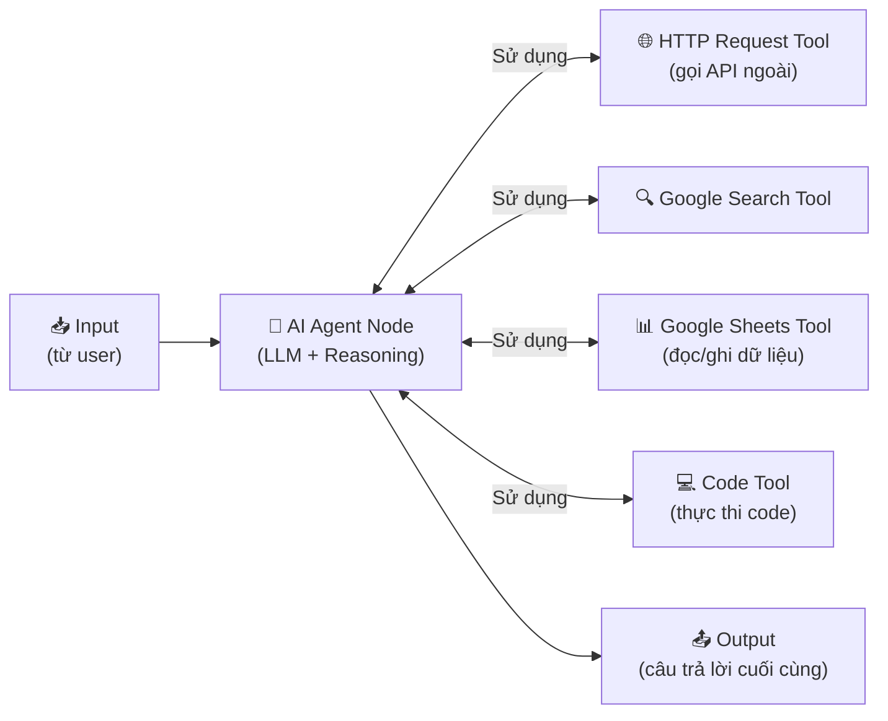
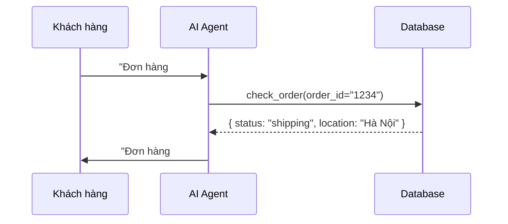

> [!nav] Điều hướng
> **Mục lục:** [[00-N8N 101 - Mục lục]]
> **Bài trước:** [[21-Kết nối OpenAI và Anthropic Claude vào n8n]]
> **Bài tiếp theo:** [[23-Ứng dụng RAG và Vector Store trong n8n]]


# 🕵️ Xây dựng AI Agent với các Tools tùy chỉnh

> [!info] Tổng quan
> **AI Agent** trong n8n không chỉ "trả lời câu hỏi" — nó **tự quyết định** cần dùng công cụ nào, gọi API nào, và thực hiện nhiều bước để hoàn thành một mục tiêu phức tạp. Đây là bước nhảy vọt từ "chatbot" sang "trợ lý tự hành".

---

## 🤖 Sự khác biệt: LLM đơn giản vs AI Agent



---

## 🏗️ Cấu trúc AI Agent trong n8n



---

## ⚙️ Thiết lập AI Agent Node

### Các thành phần bắt buộc

| Thành phần | Vai trò | Node dùng |
|---|---|---|
| **Chat Model** | Bộ não — quyết định hành động | OpenAI / Anthropic / Gemini |
| **Tools** | Công cụ Agent có thể sử dụng | HTTP Request, Code, Search... |
| **Memory** *(tùy chọn)* | Ghi nhớ lịch sử hội thoại | Window Buffer Memory |

### Các loại Agent

| Loại | Đặc điểm | Dùng khi nào |
|---|---|---|
| **ReAct Agent** | Reasoning + Acting theo vòng lặp | Hầu hết use cases |
| **Plan-and-Execute** | Lập kế hoạch trước, thực hiện sau | Tasks phức tạp nhiều bước |
| **OpenAI Functions** | Dùng function calling của OpenAI | Cần độ chính xác cao |

---

## 🔧 Tạo Custom Tool cho Agent

### Tool 1: Tra cứu thông tin từ Google Sheets

Kết nối **Google Sheets Tool** → Agent có thể đọc/tìm kiếm dữ liệu từ bảng tính của bạn.

**Cấu hình:**
- Tool Name: `search_product_database`
- Description: `Tìm kiếm thông tin sản phẩm trong database. Input: tên sản phẩm (string)`
- Operation: Get rows with filter

---

### Tool 2: Gửi email qua Gmail

```
Tool Name: send_email
Description: Gửi email đến địa chỉ được chỉ định. 
Input JSON: { "to": "email@example.com", "subject": "...", "body": "..." }
```

---

### Tool 3: Gọi Custom API

Dùng **HTTP Request Tool** để tạo tool gọi bất kỳ API nào:
- Name: `get_weather`
- Description: `Lấy thông tin thời tiết hiện tại. Input: tên thành phố`
- URL: `https://api.openweathermap.org/data/2.5/weather?q={{ $fromAI("city") }}&appid=YOUR_KEY`

---

## 🎯 Ví dụ: Agent Hỗ trợ Khách hàng

**Hệ thống:**
```
Bạn là trợ lý hỗ trợ khách hàng của cửa hàng ABC.
Bạn có thể:
1. Tra cứu thông tin đơn hàng (dùng tool: check_order)
2. Kiểm tra tồn kho sản phẩm (dùng tool: check_inventory)  
3. Tạo ticket hỗ trợ (dùng tool: create_support_ticket)

Luôn xác nhận thông tin với khách trước khi thực hiện bất kỳ hành động nào.
```

**Luồng hoạt động:**


---

## ⚠️ Lưu ý khi xây dựng AI Agent

> [!warning] Kiểm soát quyền của Agent
> Agent có thể thực hiện các hành động thực tế (gửi email, ghi dữ liệu, gọi API thanh toán...). Hãy giới hạn tools chỉ ở mức cần thiết và thêm bước xác nhận cho các hành động quan trọng.

> [!tip] Viết Tool Description thật rõ ràng
> Agent quyết định dùng tool nào dựa vào **tên** và **description** của tool. Description phải mô tả rõ: tool làm gì, input cần gì, output trả về gì. Đây là yếu tố quan trọng nhất để Agent hoạt động đúng.

---

> [!nav] Điều hướng
> **Bài trước:** [[21-Kết nối OpenAI và Anthropic Claude vào n8n]]
> **Bài tiếp theo:** [[23-Ứng dụng RAG và Vector Store trong n8n]]
