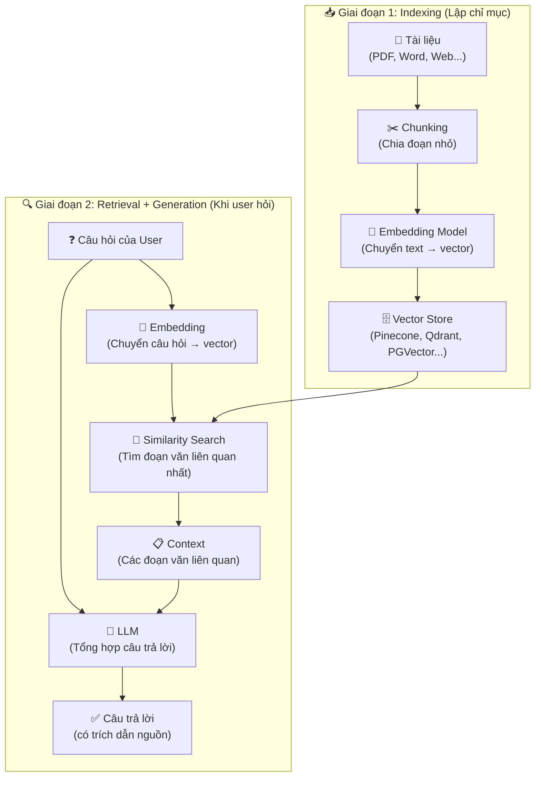
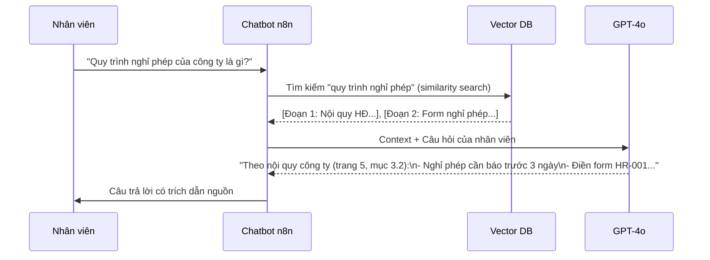

> [!nav] Điều hướng
> **Mục lục:** [[index|🏠 Wiki N8N - Trang chủ]]
> **Bài trước:** [[22-Xây dựng AI Agent với các Tools tùy chỉnh]]
> **Bài tiếp theo:** [[24-Cấp phát Memory cho AI Agent]]


# 📚 Ứng dụng RAG (Retrieval-Augmented Generation) & Vector Store

> [!info] Tổng quan
> **RAG** là kỹ thuật giúp AI "đọc" và "nhớ" tài liệu riêng của bạn — không cần fine-tune model. Thay vì AI chỉ dựa vào kiến thức training cũ, nó sẽ tìm kiếm trong **knowledge base** của bạn rồi mới trả lời. Đây là nền tảng để xây dựng chatbot doanh nghiệp, Q&A trên tài liệu nội bộ.

---

## 🧠 RAG hoạt động như thế nào?



---

## 🛠️ Thiết lập RAG Pipeline trong n8n

### Workflow 1: Indexing (Chạy 1 lần hoặc khi có tài liệu mới)

```
📄 Đọc tài liệu
   ↓
✂️ Default Data Loader (Chia chunk)
   ↓
🔢 Embeddings OpenAI (text-embedding-3-small)
   ↓
🗄️ Vector Store (Pinecone / Qdrant / Supabase pgvector)
```

### Workflow 2: Q&A (Chạy khi user đặt câu hỏi)

```
❓ Nhận câu hỏi (Webhook / Chat trigger)
   ↓
🤖 AI Agent với Vector Store Tool
   ↓
📤 Trả lời kèm nguồn trích dẫn
```

---

## 📦 Các Vector Store được n8n hỗ trợ

| Vector Store | Loại | Đặc điểm | Phù hợp với |
|---|---|---|---|
| **Pinecone** | Cloud | Managed, dễ dùng, free tier | MVP, production nhỏ |
| **Qdrant** | Self-host/Cloud | Open source, hiệu suất cao | Self-host, privacy |
| **Supabase pgvector** | Cloud/Self-host | Kết hợp với PostgreSQL | Đã dùng Supabase |
| **In-Memory** | RAM | Không cần cài đặt | Testing, prototype |
| **Weaviate** | Self-host/Cloud | GraphQL API | Enterprise |

---

## ⚙️ Cấu hình chi tiết

### 1. Chọn Embedding Model

| Model | Dimensions | Chi phí | Chất lượng |
|---|---|---|---|
| `text-embedding-3-small` | 1536 | 💚 Rất rẻ | ⭐⭐⭐⭐ |
| `text-embedding-3-large` | 3072 | 💛 Trung bình | ⭐⭐⭐⭐⭐ |
| `nomic-embed-text` | 768 | 💚 Free (local) | ⭐⭐⭐ |

> [!tip] Khuyến nghị
> Dùng `text-embedding-3-small` cho hầu hết use cases — rẻ, nhanh và đủ tốt. Chỉ nâng lên `large` khi cần độ chính xác cao hơn.

### 2. Cấu hình Chunking

| Tham số | Giá trị gợi ý | Ghi chú |
|---|---|---|
| **Chunk Size** | `500-1000` tokens | Quá nhỏ mất context, quá lớn giảm độ chính xác |
| **Chunk Overlap** | `100-200` tokens | Đảm bảo không mất thông tin ở ranh giới |

---

## 💡 Ví dụ ứng dụng thực tế

### Chatbot Q&A trên tài liệu nội bộ công ty



---

## 🔄 Quy trình tự động cập nhật Knowledge Base

```
📡 Trigger: File mới trong Google Drive
      ↓
📄 Đọc nội dung file
      ↓
🔍 Kiểm tra file đã được index chưa? (Query Vector Store)
      ↓ (chưa có)
✂️ Chunk + Embed
      ↓
🗄️ Lưu vào Vector Store
      ↓
✅ Ghi log vào Google Sheets
```

---

> [!nav] Điều hướng
> **Bài trước:** [[22-Xây dựng AI Agent với các Tools tùy chỉnh]]
> **Bài tiếp theo:** [[24-Cấp phát Memory cho AI Agent]]
