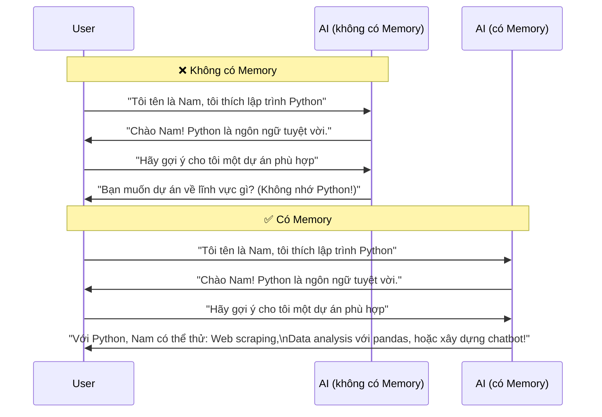
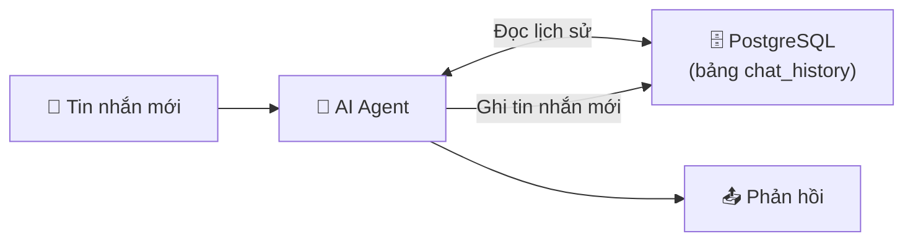

> [!nav] Điều hướng
> **Mục lục:** [[index|🏠 Wiki N8N - Trang chủ]]
> **Bài trước:** [[23-Ứng dụng RAG và Vector Store trong n8n]]
> **Bài tiếp theo:** [[13-Dự án - Kết nối Lark với Obsidian qua n8n]]


# 🧠 Cấp phát Memory cho AI Agent

> [!info] Tổng quan
> Mặc định, mỗi lần bạn nhắn tin với AI là một cuộc hội thoại **hoàn toàn mới** — AI không nhớ bạn đã nói gì trước đó. **Memory** giải quyết điều này, giúp AI duy trì ngữ cảnh qua nhiều tin nhắn, thậm chí qua nhiều phiên làm việc khác nhau.

---

## 🧩 Tại sao Memory quan trọng?



---

## 📦 Các loại Memory trong n8n

### 1. Window Buffer Memory (Phổ biến nhất)
Lưu **N tin nhắn gần nhất** trong RAM.

| Ưu điểm | Nhược điểm |
|---|---|
| Đơn giản, không cần cài đặt | Mất khi workflow restart |
| Phù hợp cho chatbot đơn giản | Không lưu trữ lâu dài |
| Kiểm soát được context window | Giới hạn số tin nhắn |

**Cấu hình:**
- **Session ID:** `{{ $json.sessionId }}` — mỗi user/cuộc trò chuyện có 1 session riêng
- **Context Window Length:** `10` — lưu 10 tin nhắn gần nhất

---

### 2. PostgreSQL / MySQL Chat Memory
Lưu lịch sử hội thoại vào **database** — bền vững, không mất sau khi restart.



**Phù hợp với:** Production chatbot, cần lưu lịch sử lâu dài.

---

### 3. Redis Chat Memory
Lưu vào **Redis** — nhanh, có TTL (tự động xóa sau X giây).

**Phù hợp với:** High-traffic chatbot, cần tốc độ cao, muốn lịch sử tự hết hạn.

---

### 4. Zep Memory
**Zep** là memory engine chuyên dụng — tự động tóm tắt lịch sử cũ, trích xuất thực thể (entities), và lưu trữ thông minh.

**Phù hợp với:** Long-term memory, cần AI nhớ thông tin về user qua nhiều tuần/tháng.

---

## ⚙️ Thiết lập Memory: Hướng dẫn từng bước

### Bước 1: Tạo Session ID

Mỗi cuộc hội thoại cần 1 ID duy nhất để phân biệt:

```javascript
// Trong Code Node hoặc Expression
// Dùng chat_id từ Telegram
{{ $json.message.chat.id }}

// Hoặc tạo từ email user
{{ $json.userEmail.replace("@", "_").replace(".", "_") }}

// Hoặc UUID ngẫu nhiên cho session mới
{{ $execution.id }}
```

### Bước 2: Thêm Memory Node vào AI Agent

1. Mở **AI Agent Node**
2. Kéo thả **Window Buffer Memory** (hoặc loại khác) vào phần **Memory**
3. Cấu hình **Session ID** bằng expression từ Bước 1
4. Cấu hình **Context Window Length** (số tin nhắn lưu)

### Bước 3: Test với Chat Trigger

Dùng **Chat Trigger** để test trực tiếp trong n8n UI — nhắn nhiều tin và kiểm tra AI có nhớ context không.

---

## 🎯 Best Practices

| Tình huống | Memory được dùng | Session ID nên là |
|---|---|---|
| Chatbot Telegram | Window Buffer / PostgreSQL | `chat.id` của Telegram |
| Web chatbot | PostgreSQL | User ID + session token |
| Xử lý email chuỗi | Window Buffer | Email thread ID |
| Support ticket | PostgreSQL | Ticket ID |

> [!tip] Luôn xóa memory khi cần reset
> Thêm lệnh `/reset` hoặc `/clear` để user có thể xóa lịch sử hội thoại. Điều này cũng giúp tránh context bị "nhiễu" bởi thông tin cũ không còn liên quan.

> [!caution] GDPR & Privacy
> Nếu lưu lịch sử chat vào database, hãy đảm bảo bạn tuân thủ quy định bảo mật dữ liệu người dùng. Xem xét mã hóa dữ liệu và chính sách xóa dữ liệu rõ ràng.

---

> [!nav] Điều hướng
> **Bài trước:** [[23-Ứng dụng RAG và Vector Store trong n8n]]
> **Bài tiếp theo:** [[13-Dự án - Kết nối Lark với Obsidian qua n8n]]
