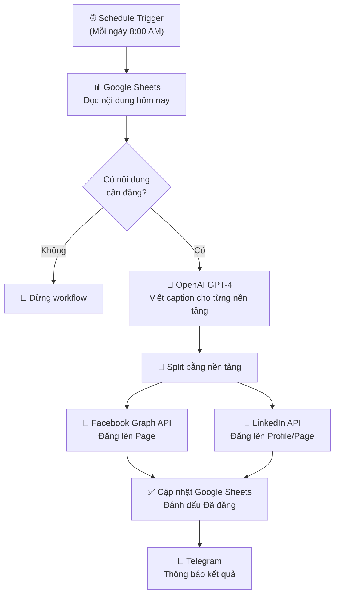
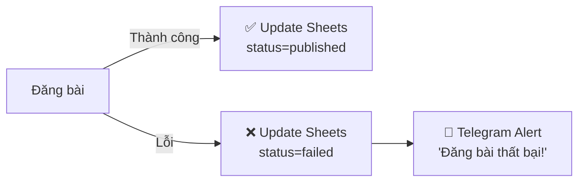

> [!nav] Điều hướng
> **Mục lục:** [[index|🏠 Wiki N8N - Trang chủ]]
> **Bài trước:** [[13-Dự án - Kết nối Lark với Obsidian qua n8n]]
> **Bài tiếp theo:** [[31-Tạo Telegram Bot phản hồi tự động bằng AI]]


# 📱 Dự án: Tự động lập lịch & đăng bài Social Media

> [!info] Tổng quan dự án
> Xây dựng một hệ thống **Content Pipeline** hoàn chỉnh: từ việc lấy nội dung từ Google Sheets, tự động viết lại caption bằng AI (GPT-4), đến lên lịch và đăng bài lên **Facebook Page** và **LinkedIn** — tất cả tự động, không cần động tay.

---

## 🎯 Mục tiêu & Kết quả mong đợi

| Mục tiêu | Kết quả |
|---|---|
| Lập lịch nội dung từ Google Sheets | Workflow đọc nội dung theo ngày |
| Tạo caption tự động bằng AI | Caption đa phong cách cho từng nền tảng |
| Đăng lên Facebook Page | Post được published đúng giờ |
| Đăng lên LinkedIn | Post được published đúng giờ |
| Thông báo kết quả | Telegram alert sau khi đăng xong |

---

## 🏗️ Kiến trúc hệ thống



---

## 📋 Chuẩn bị trước khi bắt đầu

### 1. Google Sheets — Template nội dung

Tạo Google Sheet với cấu trúc sau:

| Cột | Tên | Mô tả |
|---|---|---|
| A | `publish_date` | Ngày đăng (DD/MM/YYYY) |
| B | `topic` | Chủ đề bài viết |
| C | `key_message` | Thông điệp cốt lõi (1-2 câu) |
| D | `image_url` | URL hình ảnh (Unsplash/Drive) |
| E | `target_platforms` | `facebook,linkedin` |
| F | `status` | `pending` / `published` / `failed` |
| G | `published_at` | Timestamp sau khi đăng |

### 2. Credentials cần có

- ✅ **Google Sheets** (OAuth2)
- ✅ **OpenAI API** (API Key)
- ✅ **Facebook Graph API** (Page Access Token — không hết hạn)
- ✅ **LinkedIn OAuth2** (Company Page Access)
- ✅ **Telegram Bot** (Bot Token)

> [!tip] Lấy Facebook Long-lived Access Token
> Token mặc định chỉ tồn tại 1 giờ. Để lấy token dài hạn (60 ngày), dùng Graph API Explorer → Exchange for Long-Lived Token → Gia hạn bằng cách refresh định kỳ.

---

## ⚙️ Xây dựng workflow từng bước

### Step 1 — Schedule Trigger
```json
{
  "rule": {
    "hour": 8,
    "minute": 0
  },
  "timezone": "Asia/Ho_Chi_Minh"
}
```

### Step 2 — Đọc Google Sheets

Dùng node **Google Sheets** → Operation: `Get Many Rows`

```javascript
// Filter: Chỉ lấy hàng có publish_date = hôm nay và status = pending
// Dùng Filter trong Sheets hoặc IF node sau khi lấy về
```

### Step 3 — Tạo caption bằng AI

Node **OpenAI** → Model: `gpt-4o` → System prompt:

```
Bạn là copywriter chuyên nghiệp. Viết caption cho bài đăng mạng xã hội.
Dựa vào chủ đề và thông điệp được cung cấp, tạo:
1. Caption Facebook: Thân thiện, có emoji, 150-200 từ, có CTA
2. Caption LinkedIn: Chuyên nghiệp, insight-driven, 100-150 từ, có hashtag

Chủ đề: {{ $json.topic }}
Thông điệp: {{ $json.key_message }}

Trả về JSON format:
{
  "facebook": "...",
  "linkedin": "..."
}
```

### Step 4 — Parse JSON từ AI

Node **Code** (JavaScript):
```javascript
const aiResponse = JSON.parse($input.first().json.message.content);
return [{
  json: {
    ...$input.first().json,
    facebook_caption: aiResponse.facebook,
    linkedin_caption: aiResponse.linkedin
  }
}];
```

### Step 5 — Đăng Facebook

Node **HTTP Request**:
```
Method: POST
URL: https://graph.facebook.com/v19.0/{{ $env.FB_PAGE_ID }}/feed
Body:
{
  "message": "{{ $json.facebook_caption }}",
  "link": "{{ $json.image_url }}",
  "access_token": "{{ $env.FB_PAGE_ACCESS_TOKEN }}"
}
```

### Step 6 — Đăng LinkedIn

Node **LinkedIn** → Operation: `Create Post` → Organization/Profile

### Step 7 — Cập nhật trạng thái

Node **Google Sheets** → Operation: `Update Row`:
```javascript
// Cập nhật cột status = "published"
// Cột published_at = DateTime.now()
```

---

## 🔧 Xử lý lỗi



Bật **"Continue on Fail"** trên node HTTP Request Facebook/LinkedIn để workflow không chết khi một platform lỗi.

---

## 📈 Kết quả & Mở rộng

**Kết quả sau khi hoàn thành:**
- ✅ Tự động đăng đúng giờ mỗi ngày
- ✅ Caption được tối ưu riêng cho từng nền tảng
- ✅ Dashboard theo dõi qua Google Sheets

**Mở rộng tiếp theo:**
- Thêm Instagram (qua Facebook Graph API)
- Thêm Twitter/X (qua Twitter API v2)
- Tích hợp Canva API để tự tạo ảnh
- A/B test caption với 2 version AI khác nhau

---

> [!nav] Điều hướng
> **Bài trước:** [[13-Dự án - Kết nối Lark với Obsidian qua n8n]]
> **Bài tiếp theo:** [[31-Tạo Telegram Bot phản hồi tự động bằng AI]]
