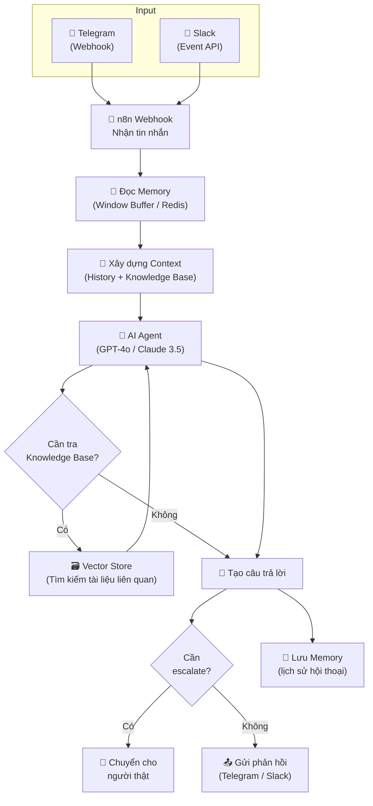

> [!nav] Điều hướng
> **Mục lục:** [[index|🏠 Wiki N8N - Trang chủ]]
> **Bài trước:** [[30-Tự động lập lịch và đăng bài Social Media]]
> **Bài tiếp theo:** [[32-Đồng bộ Lead từ Landing Page sang CRM và Google Sheets]]


# 🤖 Dự án: Tạo Telegram Bot / Slack Bot phản hồi tự động bằng AI

> [!info] Tổng quan dự án
> Xây dựng một **AI Chatbot** tích hợp trực tiếp vào Telegram hoặc Slack. Bot có khả năng trả lời câu hỏi dựa trên **knowledge base riêng của bạn** (tài liệu nội bộ, FAQ, sản phẩm...), ghi nhớ lịch sử hội thoại, và escalate lên người thật khi cần.

---

## 🎯 Mục tiêu & Use Cases

| Use Case | Mô tả |
|---|---|
| 💼 **Support nội bộ** | Bot trả lời câu hỏi HR, IT Helpdesk trong Slack |
| 🛍️ **Hỗ trợ khách hàng** | Bot tư vấn sản phẩm 24/7 trong Telegram |
| 📚 **Q&A tài liệu** | Bot trả lời từ SOP, chính sách công ty |
| 🔔 **Alert Bot** | Bot nhận lệnh và thực thi action trong n8n |

---

## 🏗️ Kiến trúc hệ thống



---

## 📋 Chuẩn bị

### Phần A — Telegram Bot

1. Mở Telegram → Tìm **@BotFather**
2. Gõ `/newbot` → Đặt tên → Lấy **Bot Token**
3. Trong n8n: Tạo Credential **Telegram API** với token vừa lấy
4. Thiết lập Webhook: n8n sẽ tự kết nối khi dùng **Telegram Trigger** node

### Phần B — Slack Bot

1. Truy cập [api.slack.com/apps](https://api.slack.com/apps) → Create New App
2. Cấu hình **Event Subscriptions** → Request URL = n8n webhook URL
3. Subscribe events: `message.channels`, `message.im`
4. Lấy **Bot Token** (xBots prefix) và **Signing Secret**

---

## ⚙️ Xây dựng workflow

### Bước 1 — Trigger nhận tin nhắn

**Telegram:**
```
Node: Telegram Trigger
Event: Message
```

**Slack:**
```
Node: Webhook (HTTP)
Path: /slack-bot
Method: POST
```

### Bước 2 — Extract thông tin từ tin nhắn

Node **Set** hoặc **Code**:
```javascript
// Telegram
const chatId = $json.message.chat.id;
const userId = $json.message.from.id;
const userMessage = $json.message.text;
const sessionId = `telegram_${chatId}`;

// Slack
const userId = $json.event.user;
const userMessage = $json.event.text;
const channelId = $json.event.channel;
const sessionId = `slack_${channelId}_${userId}`;

return [{ json: { chatId, userId, userMessage, sessionId } }];
```

### Bước 3 — AI Agent với Memory

Dùng node **AI Agent** (LangChain):

```
Agent Type: Conversational Agent
LLM: OpenAI GPT-4o
Memory: Window Buffer Memory (10 messages)
Session ID: {{ $json.sessionId }}
```

**System Prompt:**
```
Bạn là trợ lý AI của [Tên Công Ty]. Bạn hỗ trợ [mô tả công việc].
- Trả lời ngắn gọn, thân thiện, bằng tiếng Việt
- Nếu không biết câu trả lời, nói thật và hướng người dùng đến bộ phận phù hợp
- Không bịa thông tin
- Format: không dùng markdown vì hiển thị trên Telegram
```

### Bước 4 — Gửi phản hồi

**Telegram:**
```
Node: Telegram
Operation: Send Message
Chat ID: {{ $json.chatId }}
Text: {{ $json.output }}
```

**Slack:**
```
Node: Slack
Operation: Post Message
Channel: {{ $json.channelId }}
Text: {{ $json.output }}
```

---

## 🎮 Tính năng nâng cao

### Xử lý lệnh (Commands)

```javascript
// Code node — detect commands
const msg = $json.userMessage.toLowerCase().trim();

if (msg === '/help') {
  return [{ json: { isCommand: true, command: 'help' } }];
} else if (msg === '/reset') {
  return [{ json: { isCommand: true, command: 'reset_memory' } }];
} else if (msg.startsWith('/search ')) {
  return [{ json: { isCommand: true, command: 'search', query: msg.slice(8) } }];
}

return [{ json: { isCommand: false } }];
```

### Escalation tự động

```javascript
// Detect khi user cần hỗ trợ người thật
const escalationKeywords = ['gặp người', 'nhân viên', 'hỗ trợ thêm', 'khiếu nại', 'urgent'];
const needsHuman = escalationKeywords.some(k => $json.userMessage.toLowerCase().includes(k));

return [{ json: { ...$json, needsHuman } }];
```

---

## 📊 Monitoring & Analytics

Ghi lại mỗi cuộc hội thoại vào **Google Sheets** hoặc **Airtable**:

| Cột | Nội dung |
|---|---|
| `timestamp` | Thời điểm |
| `user_id` | ID người dùng |
| `platform` | telegram / slack |
| `user_message` | Câu hỏi |
| `bot_response` | Câu trả lời |
| `response_time_ms` | Thời gian phản hồi |
| `escalated` | true / false |

---

> [!nav] Điều hướng
> **Bài trước:** [[30-Tự động lập lịch và đăng bài Social Media]]
> **Bài tiếp theo:** [[32-Đồng bộ Lead từ Landing Page sang CRM và Google Sheets]]
