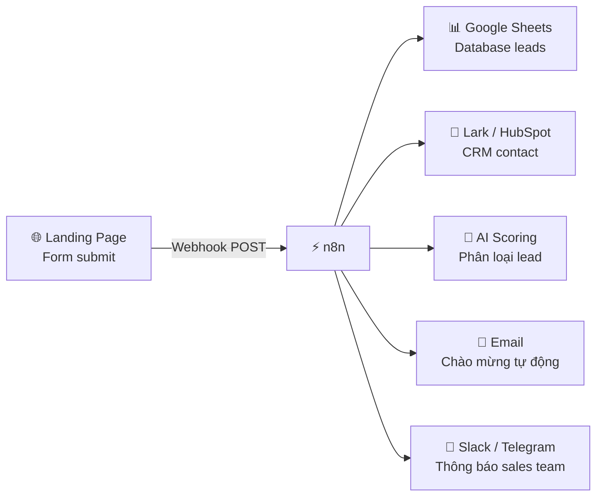
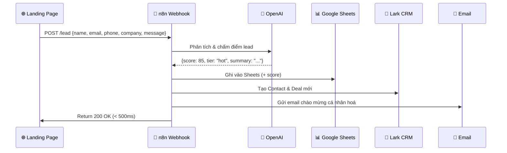

> [!nav] Điều hướng
> **Mục lục:** [[index|🏠 Wiki N8N - Trang chủ]]
> **Bài trước:** [[31-Tạo Telegram Bot phản hồi tự động bằng AI]]
> **Bài tiếp theo:** [[33-Đọc email tự động phân tích bằng AI và lưu file đính kèm]]


# 📊 Dự án: Đồng bộ Lead từ Landing Page sang CRM & Google Sheets

> [!info] Tổng quan dự án
> Xây dựng hệ thống **Lead Capture & CRM Pipeline** tự động: khi khách hàng điền form trên Landing Page → n8n tự động lưu vào Google Sheets (làm dashboard), thêm vào CRM (Lark/HubSpot), phân loại lead bằng AI, và gửi email chào mừng ngay lập tức — không cần thao tác thủ công.

---

## 🎯 Kết quả mong đợi



---

## 🏗️ Kiến trúc chi tiết



---

## 📋 Chuẩn bị

### 1. Setup Landing Page gửi Webhook

**Typeform** (Recommended — tích hợp sẵn với n8n):
```
Form → Connect → Webhooks → nhập n8n webhook URL
```

**HTML Form tự build:**
```html
<form id="leadForm">
  <input name="name" placeholder="Họ tên" required>
  <input name="email" type="email" placeholder="Email" required>
  <input name="phone" placeholder="Số điện thoại">
  <input name="company" placeholder="Công ty">
  <textarea name="message" placeholder="Bạn cần giúp gì?"></textarea>
  <button type="submit">Đăng ký ngay</button>
</form>

<script>
document.getElementById('leadForm').onsubmit = async (e) => {
  e.preventDefault();
  const data = Object.fromEntries(new FormData(e.target));
  await fetch('https://n8n.yourdomain.com/webhook/lead-capture', {
    method: 'POST',
    headers: { 'Content-Type': 'application/json' },
    body: JSON.stringify(data)
  });
};
</script>
```

### 2. Google Sheets Template

Cột cần có:
`id | created_at | name | email | phone | company | message | lead_score | tier | status | assigned_to | notes`

---

## ⚙️ Xây dựng Workflow

### Step 1 — Webhook nhận lead

```
Node: Webhook
Path: /lead-capture
Method: POST
Response: Return immediately (tránh timeout cho user)
```

### Step 2 — Validate & Normalize data

Node **Code**:
```javascript
const { name, email, phone, company, message } = $json.body;

// Validate email
const emailRegex = /^[^\s@]+@[^\s@]+\.[^\s@]+$/;
if (!email || !emailRegex.test(email)) {
  throw new Error('Email không hợp lệ');
}

// Normalize phone (chuẩn hoá về +84...)
const normalizePhone = (p) => {
  if (!p) return '';
  p = p.replace(/\D/g, '');
  if (p.startsWith('0')) p = '84' + p.slice(1);
  return '+' + p;
};

return [{
  json: {
    id: Date.now().toString(),
    created_at: new Date().toISOString(),
    name: name?.trim(),
    email: email?.toLowerCase().trim(),
    phone: normalizePhone(phone),
    company: company?.trim() || 'Cá nhân',
    message: message?.trim() || '',
  }
}];
```

### Step 3 — AI Lead Scoring

Node **OpenAI**:
```
Model: gpt-4o-mini (đủ dùng, rẻ hơn)
System Prompt:
  Bạn là chuyên gia sales. Phân tích thông tin lead và trả về JSON:
  {
    "score": <số 0-100>,
    "tier": "<cold|warm|hot>",
    "reason": "<giải thích ngắn>",
    "suggested_action": "<hành động đề xuất>"
  }
  
  Tiêu chí:
  - Hot (70-100): Có tên công ty, mô tả nhu cầu rõ ràng, email công ty
  - Warm (40-69): Có một vài thông tin, nhu cầu chung chung
  - Cold (0-39): Thiếu thông tin, có vẻ không nghiêm túc

User: {{ JSON.stringify($json) }}
```

### Step 4 — Merge AI response vào data

Node **Code**:
```javascript
const leadData = $('Step 2 - Normalize').first().json;
const aiResult = JSON.parse($input.first().json.message.content);

return [{
  json: {
    ...leadData,
    lead_score: aiResult.score,
    tier: aiResult.tier,
    ai_reason: aiResult.reason,
    suggested_action: aiResult.suggested_action,
    status: 'new',
    assigned_to: ''
  }
}];
```

### Step 5 — Ghi vào Google Sheets

```
Node: Google Sheets → Append Row
Sheet: Leads Database
Mapping: tất cả fields từ Step 4
```

### Step 6 — Tạo Contact trong Lark CRM

```
Node: HTTP Request
Method: POST
URL: https://open.larksuite.com/open-apis/crm/v1/contacts
Headers:
  Authorization: Bearer {{ $env.LARK_ACCESS_TOKEN }}
Body:
{
  "name": "{{ $json.name }}",
  "email": ["{{ $json.email }}"],
  "phone": ["{{ $json.phone }}"],
  "company_name": "{{ $json.company }}",
  "remark": "AI Score: {{ $json.lead_score }} ({{ $json.tier }})\n{{ $json.message }}"
}
```

### Step 7 — Gửi email chào mừng cá nhân hoá

Node **Gmail** hoặc **SendGrid**:

```
To: {{ $json.email }}
Subject: Chào {{ $json.name }}! Chúng tôi đã nhận được yêu cầu của bạn 🎉
Body (HTML):
  Xin chào {{ $json.name }},
  Cảm ơn bạn đã quan tâm đến [Tên Công Ty]!
  
  Chúng tôi đã nhận được thông tin của bạn và sẽ liên hệ trong vòng 24 giờ.
  
  Trong thời gian chờ, bạn có thể tham khảo:
  📚 Blog: [link]
  🎥 Demo: [link]
  💬 Chat ngay: [link]
```

### Step 8 — Thông báo Sales Team

**Hot lead → alert ngay:**
```javascript
// IF node: tier === 'hot'
// → Slack/Telegram message:
// 🔥 HOT LEAD!
// 👤 Tên: {{ name }}
// 🏢 Công ty: {{ company }}
// 📧 Email: {{ email }}
// 📊 AI Score: {{ lead_score }}/100
// 💡 Suggested Action: {{ suggested_action }}
```

---

## 📈 Dashboard Google Sheets

Dùng tính năng **Charts** trong Google Sheets để tạo dashboard realtime:
- **Pie Chart:** Phân bổ Cold/Warm/Hot leads
- **Bar Chart:** Leads theo ngày/tuần
- **Line Chart:** Xu hướng leads theo thời gian

---

> [!nav] Điều hướng
> **Bài trước:** [[31-Tạo Telegram Bot phản hồi tự động bằng AI]]
> **Bài tiếp theo:** [[33-Đọc email tự động phân tích bằng AI và lưu file đính kèm]]
