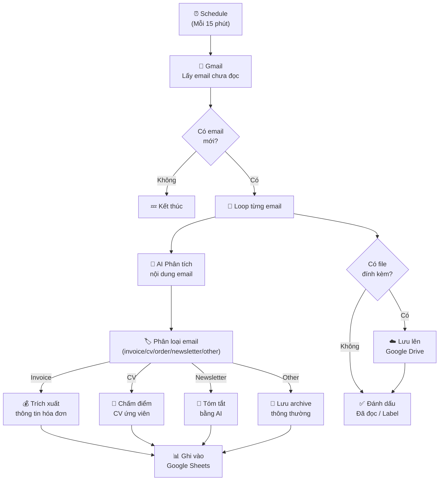
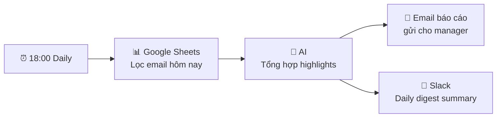

> [!nav] Điều hướng
> **Mục lục:** [[index|🏠 Wiki N8N - Trang chủ]]
> **Bài trước:** [[32-Đồng bộ Lead từ Landing Page sang CRM và Google Sheets]]
> **Bài tiếp theo:** [[34-Auto-Blogging Tự động thu thập tin tức và viết bài lên WordPress]]


# 📧 Dự án: Đọc email tự động, phân tích bằng AI và lưu file đính kèm

> [!info] Tổng quan dự án
> Xây dựng hệ thống **Email Intelligence Pipeline**: tự động đọc email mới trong Gmail, dùng AI để phân loại, trích xuất thông tin quan trọng, lưu file đính kèm vào Google Drive theo cấu trúc thư mục, và tổng hợp báo cáo hàng ngày — biến hộp thư thành dữ liệu có cấu trúc.

---

## 🎯 Use Cases thực tế

| Use Case | Mô tả |
|---|---|
| 📩 **Invoice Processing** | Đọc email hóa đơn → trích xuất số tiền → ghi vào spreadsheet |
| 📋 **CV/Resume Screening** | Nhận CV qua email → AI chấm điểm → lưu vào ATS |
| 🛒 **Order Confirmation** | Email xác nhận đơn hàng → cập nhật inventory |
| 📰 **Newsletter Digest** | Tổng hợp email newsletter → tóm tắt hàng sáng |
| 🔔 **Alert Processing** | Email alert từ server → phân tích severity → Slack alert |

---

## 🏗️ Kiến trúc hệ thống



---

## 📋 Chuẩn bị

### Gmail Setup

1. **n8n Gmail Credentials**: OAuth2 → cấp quyền `gmail.modify` và `gmail.readonly`
2. **Tạo Gmail Labels** để phân loại email sau khi xử lý:
   - `n8n/processed` — đã xử lý
   - `n8n/invoice` — hóa đơn
   - `n8n/cv` — CV ứng viên
   - `n8n/error` — lỗi xử lý

### Google Drive Setup

Tạo cấu trúc thư mục:
```
📁 Email Attachments/
├── 📁 Invoices/
│   └── 📁 2024/
│       ├── 📁 01-January/
│       └── 📁 02-February/
├── 📁 CVs/
└── 📁 Others/
```

---

## ⚙️ Xây dựng Workflow

### Step 1 — Lấy email chưa đọc

```
Node: Gmail → Get Many Messages
Filters:
  - is:unread
  - -label:n8n/processed
  - newer_than:1h
Limit: 50
Include Attachments: true
```

### Step 2 — Loop từng email

```
Node: Loop Over Items
Input: Danh sách email từ Step 1
```

### Step 3 — AI phân tích & phân loại

Node **OpenAI** (gpt-4o-mini):

```
System:
  Phân tích email và trả về JSON:
  {
    "category": "invoice|cv|order|newsletter|alert|other",
    "priority": "high|medium|low",
    "summary": "<tóm tắt 1-2 câu>",
    "extracted_data": {
      // Với invoice: amount, vendor, due_date, invoice_number
      // Với CV: name, position, experience_years, key_skills
      // Với order: order_id, amount, items, status
    },
    "action_required": true/false,
    "suggested_label": "..."
  }

User:
  From: {{ $json.from }}
  Subject: {{ $json.subject }}
  Date: {{ $json.date }}
  Body (first 2000 chars): {{ $json.text?.slice(0, 2000) }}
```

### Step 4 — Route theo category

Node **Switch**:
```
Route 1: category === "invoice"   → Invoice Processing sub-flow
Route 2: category === "cv"        → CV Processing sub-flow
Route 3: category === "newsletter"→ Newsletter Digest sub-flow
Default:                          → Archive
```

### Step 5 — Lưu file đính kèm vào Drive

```javascript
// Code node — xác định đường dẫn thư mục
const category = $json.ai_category;
const date = new Date($json.email_date);
const year = date.getFullYear();
const month = String(date.getMonth() + 1).padStart(2, '0');
const monthName = date.toLocaleString('vi-VN', { month: 'long' });

const folderPath = {
  'invoice': `Email Attachments/Invoices/${year}/${month}-${monthName}`,
  'cv': `Email Attachments/CVs/${year}`,
  'default': `Email Attachments/Others/${year}`
}[category] || `Email Attachments/Others/${year}`;

return [{ json: { ...$json, drive_folder: folderPath } }];
```

Node **Google Drive** → Operation: `Upload File`:
```
File: {{ $binary.attachment_0 }}
Parent Folder: {{ $json.drive_folder }}
File Name: {{ $json.email_date }}_{{ $json.attachment_name }}
```

### Step 6 — Ghi tổng hợp vào Google Sheets

```
Node: Google Sheets → Append Row
Columns:
  email_id | date | from | subject | category | priority
  summary | extracted_data | attachment_count | drive_link | processed_at
```

### Step 7 — Gán Label & Đánh dấu đã đọc

```
Node: Gmail → Add Labels
Labels: ["n8n/processed", "n8n/{{ $json.ai_category }}"]

Node: Gmail → Mark as Read
```

---

## 📊 Báo cáo tổng hợp hàng ngày

Tạo workflow phụ chạy lúc **18:00 mỗi ngày**:



**Template báo cáo:**
```
📧 Email Report - {{ date }}

📊 Tổng quan:
- Tổng email: {{ total }}
- 💰 Hóa đơn: {{ invoices }} (tổng: {{ total_amount }})
- 👤 CV: {{ cvs }}
- 📰 Newsletter: {{ newsletters }}
- ⚠️ Cần xử lý: {{ action_required }}

🔔 Nổi bật hôm nay:
{{ highlights }}
```

---

> [!nav] Điều hướng
> **Bài trước:** [[32-Đồng bộ Lead từ Landing Page sang CRM và Google Sheets]]
> **Bài tiếp theo:** [[34-Auto-Blogging Tự động thu thập tin tức và viết bài lên WordPress]]
