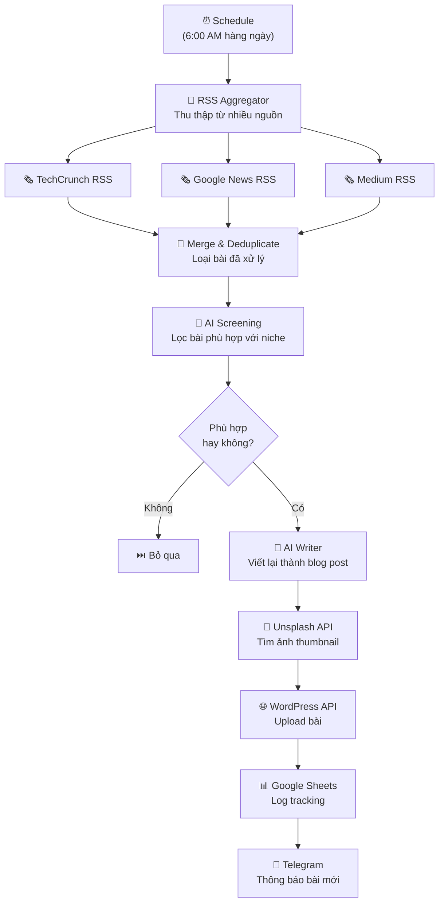

> [!nav] Điều hướng
> **Mục lục:** [[index|🏠 Wiki N8N - Trang chủ]]
> **Bài trước:** [[33-Đọc email tự động phân tích bằng AI và lưu file đính kèm]]


# 📝 Dự án: Auto-Blogging — Tự động thu thập tin tức & viết bài lên WordPress

> [!info] Tổng quan dự án
> Xây dựng hệ thống **AI Content Factory**: tự động thu thập bài viết từ RSS feeds / Google News, dùng AI để tóm tắt và viết lại thành bài blog hoàn chỉnh theo phong cách của bạn, tạo ảnh thumbnail tự động, rồi publish hoặc lưu draft lên WordPress — tất cả tự động hàng ngày.

> [!warning] Lưu ý đạo đức
> Hệ thống này được thiết kế để **tổng hợp và viết lại** (không copy) nội dung, thêm góc nhìn cá nhân, và cite nguồn gốc. Luôn ghi rõ nguồn và sử dụng có trách nhiệm để tránh vi phạm bản quyền.

---

## 🎯 Kết quả mong đợi

| Mục tiêu | Kết quả |
|---|---|
| Thu thập tin tức tự động | 10-20 bài/ngày từ nhiều nguồn |
| AI lọc & chọn chủ đề phù hợp | Chỉ giữ bài liên quan đến niche |
| AI viết lại thành blog post | Bài 800-1500 từ, SEO-optimized |
| Tự động upload thumbnail | Ảnh từ Unsplash theo chủ đề |
| Publish lên WordPress | Draft để review hoặc auto-publish |

---

## 🏗️ Kiến trúc hệ thống



---

## 📋 Chuẩn bị

### Credentials cần có

- ✅ **WordPress** (Application Password — không phải tài khoản chính)
- ✅ **OpenAI API** (gpt-4o cho writing, gpt-4o-mini cho screening)
- ✅ **Unsplash API** (miễn phí, 50 req/giờ)
- ✅ **Google Sheets** (tracking)
- ✅ **Telegram Bot** (thông báo)

### Tạo WordPress Application Password

```
WordPress Admin → Users → Thêm Application Password
Tên: n8n-auto-blog
→ Copy password được tạo ra
```

### Danh sách RSS Feeds theo niche

**Công nghệ & AI:**
```
https://techcrunch.com/feed/
https://feeds.feedburner.com/oreilly/radar/atom
https://www.technologyreview.com/feed/
https://news.google.com/rss/search?q=artificial+intelligence&hl=vi&gl=VN&ceid=VN:vi
```

**Kinh doanh & Marketing:**
```
https://feeds.feedburner.com/entrepreneur/latest
https://news.google.com/rss/search?q=digital+marketing&hl=vi&gl=VN
https://www.hubspot.com/marketing/blog/rss.xml
```

---

## ⚙️ Xây dựng Workflow

### Step 1 — Thu thập RSS Feeds

Node **RSS Read** (lặp lại cho từng feed):
```
URL: [RSS feed URL]
Limit: 10 bài mới nhất
```

### Step 2 — Kiểm tra bài đã xử lý

Node **Google Sheets** → tìm theo `article_url`:
```javascript
// Nếu đã có trong Sheets → skip
// Chưa có → tiếp tục xử lý
const processed = $('Sheets Lookup').first().json;
if (processed.rowNumber) {
  return []; // skip
}
return [$input.first()];
```

### Step 3 — AI Screening

Node **OpenAI** (gpt-4o-mini — tiết kiệm chi phí):

```
System:
  Bạn là content strategist. Đánh giá bài viết có phù hợp với niche không.
  Niche của blog: [MÔ TẢ NICHE CỦA BẠN]
  
  Trả về JSON:
  {
    "is_relevant": true/false,
    "relevance_score": <0-100>,
    "reason": "...",
    "suggested_angle": "Góc nhìn nên khai thác..."
  }

User:
  Title: {{ $json.title }}
  Description: {{ $json.contentSnippet }}
  Source: {{ $json.link }}
```

### Step 4 — AI Writer (Blog Post Generator)

Node **OpenAI** (gpt-4o):

```
System:
  Bạn là blogger chuyên nghiệp viết bằng tiếng Việt.
  Phong cách: [Học thuật/Thân thiện/Chuyên sâu]
  
  Viết bài blog hoàn chỉnh từ thông tin nguồn, bao gồm:
  1. Tiêu đề SEO hấp dẫn (60 chars)
  2. Meta description (155 chars)  
  3. Nội dung bài (800-1200 từ) với H2, H3
  4. Kết luận + CTA
  5. 5-8 tags SEO liên quan
  
  QUAN TRỌNG: Viết lại theo góc nhìn cá nhân, KHÔNG copy. Ghi nguồn ở cuối.
  
  Trả về JSON:
  {
    "title": "...",
    "meta_description": "...",
    "content": "<HTML content>",
    "excerpt": "...",
    "tags": ["tag1", "tag2"],
    "focus_keyword": "..."
  }

User:
  Original Title: {{ $json.title }}
  Source Content: {{ $json.content?.slice(0, 3000) }}
  Suggested Angle: {{ $json.suggested_angle }}
  Source URL: {{ $json.link }}
```

### Step 5 — Lấy ảnh thumbnail từ Unsplash

Node **HTTP Request**:
```
Method: GET
URL: https://api.unsplash.com/search/photos
Query Params:
  query: {{ $json.focus_keyword }}
  per_page: 1
  orientation: landscape
Headers:
  Authorization: Client-ID {{ $env.UNSPLASH_ACCESS_KEY }}
```

### Step 6 — Upload ảnh vào WordPress Media

```
Node: HTTP Request
Method: POST
URL: https://yourblog.com/wp-json/wp/v2/media
Auth: Basic (username + application password)
Binary Data: {{ $binary.image }}
Headers:
  Content-Disposition: attachment; filename="{{ $json.focus_keyword }}-cover.jpg"
```

### Step 7 — Tạo bài viết WordPress

```javascript
// Code node — Chuẩn bị payload WordPress
const post = $json.ai_content;
const mediaId = $('Upload Image').first().json.id;

return [{
  json: {
    title: post.title,
    content: post.content,
    excerpt: post.excerpt,
    status: 'draft', // 'publish' để tự động publish
    featured_media: mediaId,
    tags: [], // sẽ resolve sau
    meta: {
      _yoast_wpseo_metadesc: post.meta_description,
      _yoast_wpseo_focuskw: post.focus_keyword
    }
  }
}];
```

Node **WordPress** → Operation: `Create Post`

### Step 8 — Tracking & Notification

```javascript
// Ghi vào Google Sheets
// Gửi Telegram thông báo
const msg = `
📝 Bài mới đã được tạo!
📌 Tiêu đề: ${$json.title}
🔗 Link draft: ${$json.link}
📊 Relevance Score: ${$json.relevance_score}/100
🏷️ Tags: ${$json.tags.join(', ')}
⏱️ Thời gian: ${new Date().toLocaleString('vi-VN')}
`;
```

---

## 💰 Ước tính chi phí vận hành

| Hạng mục | Chi phí/tháng |
|---|---|
| OpenAI (30 bài/ngày × 30 ngày) | ~$15-25 |
| WordPress Hosting | $5-15 |
| Unsplash API | Miễn phí |
| n8n Self-host | Miễn phí |
| **Tổng** | **~$20-40/tháng** |

---

## 🚀 Mở rộng & Tối ưu

- **SEO Enhancement:** Tích hợp Yoast SEO API để tự động optimize
- **Social Share:** Sau khi publish → auto chia sẻ lên Facebook/LinkedIn
- **Performance:** Dùng `gpt-4o-mini` cho screening, `gpt-4o` chỉ cho writing
- **Quality Control:** Thêm bước human review với n8n form trước khi publish
- **Multilingual:** Dịch bài sang tiếng Anh để mở rộng audience

---

> [!nav] Điều hướng
> **Mục lục:** [[index|🏠 Wiki N8N - Trang chủ]]
> **Bài trước:** [[33-Đọc email tự động phân tích bằng AI và lưu file đính kèm]]
