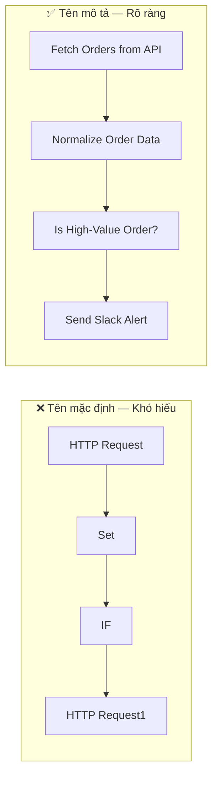
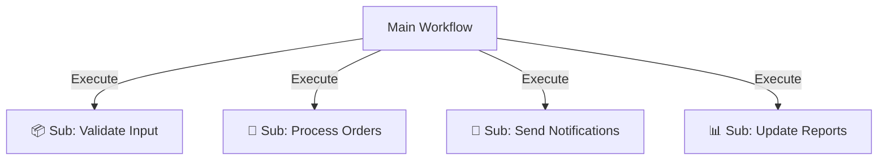
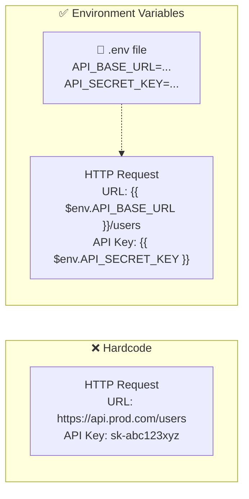

> [!nav] Điều hướng
> **Mục lục:** [[index|🏠 Wiki N8N - Trang chủ]]
> **Bài tiếp theo:** [[28-Tổng hợp các nguồn học n8n và Cộng đồng]]


# 🏆 Best Practices: Cách tổ chức Workflow gọn gàng, dễ bảo trì

> [!info] Tổng quan
> Viết một workflow chạy được thì dễ — nhưng viết một workflow mà **6 tháng sau bạn vẫn hiểu ngay** khi mở ra mới là nghệ thuật. Bài này tổng hợp những nguyên tắc và thói quen tốt nhất từ cộng đồng n8n để giúp bạn xây dựng automation **chuyên nghiệp, dễ debug và dễ chia sẻ với team**.

---

## 📐 Nguyên tắc 1: Đặt tên có ý nghĩa



**Quy tắc đặt tên node:**
- Dùng **động từ + danh từ**: `Send Email`, `Fetch User Data`, `Filter Active Contacts`
- Tránh tên mặc định: `HTTP Request`, `Set`, `IF`
- Đủ ngắn để hiển thị trên canvas, đủ rõ để hiểu ngay mục đích

---

## 🗂️ Nguyên tắc 2: Dùng Sticky Notes làm tài liệu

**Sticky Note** là công cụ documentation ngay trong canvas — miễn phí và cực kỳ hiệu quả.

**Nên dùng Sticky Note cho:**
- 📌 Tiêu đề của từng section trong workflow lớn
- 📝 Giải thích logic phức tạp bên cạnh node
- ⚠️ Cảnh báo: `"Node này gọi API có rate limit 100 req/phút"`
- 🔗 Link tài liệu: URL API docs, link ticket, link thiết kế

**Màu sắc gợi ý:**

| Màu | Ý nghĩa |
|---|---|
| 🟡 Vàng | Tiêu đề section |
| 🔵 Xanh dương | Giải thích / tài liệu |
| 🔴 Đỏ | Cảnh báo quan trọng |
| 🟢 Xanh lá | Trạng thái: "Đã hoàn thành / Production-ready" |

---

## 🧩 Nguyên tắc 3: Chia nhỏ workflow phức tạp



**Nguyên tắc Single Responsibility:** Mỗi workflow chỉ làm **một việc duy nhất**. Khi cần thay đổi logic gửi email, bạn chỉ cần sửa sub-workflow `Send Notifications` mà không ảnh hưởng phần còn lại.

---

## 🔢 Nguyên tắc 4: Phân vùng (Sectioning) bằng layout

Sắp xếp nodes theo chiều ngang, từ trái sang phải theo luồng dữ liệu:

```
[TRIGGER] → [VALIDATE] → [TRANSFORM] → [ACTION] → [NOTIFY]
```

**Mỗi section nên có:**
- Sticky Note tiêu đề ở trên
- Khoảng cách hợp lý giữa các section
- Màu nền (background) khác nhau nếu cần

---

## 🔀 Nguyên tắc 5: Xử lý lỗi ngay từ đầu, không phải sau

| Thói quen tốt ✅ | Thói quen xấu ❌ |
|---|---|
| Thêm Error Handling ngay khi tạo node | Để sau khi workflow "chạy được" rồi mới thêm |
| Bật "Continue on Fail" cho API calls | Để workflow chết khi gặp 1 lỗi nhỏ |
| Log lỗi vào Google Sheets / DB | Không biết lỗi xảy ra ở đâu |
| Gửi alert Telegram khi có lỗi critical | Chỉ biết lỗi khi user phàn nàn |

---

## 🏷️ Nguyên tắc 6: Dùng Tag để phân loại

Trong n8n, mỗi workflow có thể được gắn **tags** để tìm kiếm và lọc dễ hơn:

**Hệ thống tag gợi ý:**

| Tag | Ý nghĩa |
|---|---|
| `production` | Đang chạy trên production |
| `testing` | Đang trong giai đoạn test |
| `deprecated` | Đã lỗi thời, cần xóa |
| `client:company-abc` | Thuộc về client cụ thể |
| `type:report` | Loại workflow: báo cáo |
| `type:sync` | Loại workflow: đồng bộ dữ liệu |

---

## 📋 Nguyên tắc 7: Dùng biến môi trường, không hardcode



**Quy tắc:**
- Mọi URL, API key, thông tin nhạy cảm → **biến môi trường** hoặc **n8n Credentials**
- Không bao giờ paste API key trực tiếp vào node
- Dùng `$env.VARIABLE_NAME` để truy cập trong expressions

---

## 🧪 Nguyên tắc 8: Test trước khi deploy

```
1. 🔬 Test với dữ liệu giả (Mock data / Pin data)
   ↓
2. 🧪 Test với dữ liệu thật trong môi trường Staging
   ↓
3. 👁️ Review lại toàn bộ workflow
   ↓
4. 🚀 Deploy lên Production
   ↓
5. 📊 Monitor 24h đầu sau deploy
```

---

## ✅ Checklist trước khi Publish Workflow

```
□ Tất cả nodes đã được đặt tên có ý nghĩa
□ Có Sticky Note giải thích ở những chỗ phức tạp
□ Error Handling đã được cấu hình
□ Không có API key nào được hardcode
□ Đã test với dữ liệu thật (staging)
□ Workflow đã được gắn tag phù hợp
□ Có documentation mô tả workflow làm gì
□ Biết cách rollback nếu có vấn đề
```

---

> [!nav] Điều hướng
> **Mục lục:** [[index|🏠 Wiki N8N - Trang chủ]]
> **Bài tiếp theo:** [[28-Tổng hợp các nguồn học n8n và Cộng đồng]]
