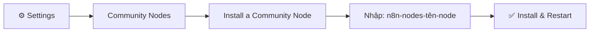

> [!nav] Điều hướng
> **Mục lục:** [[index|🏠 Wiki N8N - Trang chủ]]
> **Bài trước:** [[28-Tổng hợp các nguồn học n8n và Cộng đồng]]


# 💡 Các Node cộng đồng (Community Nodes) hữu ích nhất

> [!info] Tổng quan
> Ngoài hơn 400 node tích hợp sẵn, n8n còn có một kho **Community Nodes** — các node do cộng đồng phát triển và chia sẻ miễn phí. Những node này giúp bạn tích hợp các dịch vụ chưa được n8n hỗ trợ chính thức, hoặc thêm các tính năng hữu ích. Bài này tổng hợp những node đáng dùng nhất.

---

## 🔌 Cách cài đặt Community Nodes



**Các bước thực hiện:**
1. Vào **Settings** → **Community Nodes**
2. Click **Install a Community Node**
3. Nhập tên npm package (ví dụ: `n8n-nodes-puppeteer`)
4. Click **Install** và chờ khởi động lại

> [!warning] Lưu ý bảo mật
> Community Nodes là code của bên thứ ba. Chỉ cài đặt từ các nguồn **tin cậy, có sao GitHub cao, và được cập nhật thường xuyên**. Kiểm tra kỹ trước khi dùng trong production.

---

## 🌟 Top Community Nodes theo danh mục

### 🌐 Web Scraping & Browser Automation

#### `n8n-nodes-puppeteer`
Điều khiển trình duyệt Chrome/Chromium để scrape web, chụp screenshot, fill form tự động.

```
npm: n8n-nodes-puppeteer
GitHub: ★★★★ | Cập nhật: Thường xuyên
```

**Use cases:**
- Scrape dữ liệu từ website không có API
- Chụp screenshot tự động cho báo cáo
- Tự động điền form và đăng nhập

---

#### `n8n-nodes-browserless`
Tương tự Puppeteer nhưng kết nối đến dịch vụ **Browserless.io** — không cần cài Chrome trên server.

```
npm: n8n-nodes-browserless
```

---

### 📱 Messaging & Notifications

#### `n8n-nodes-evolution-api`
Tích hợp **WhatsApp** thông qua Evolution API — gửi/nhận tin nhắn WhatsApp tự động.

```
npm: n8n-nodes-evolution-api
```

**Use cases:**
- Chatbot WhatsApp tự động
- Gửi thông báo order qua WhatsApp
- Hỗ trợ khách hàng qua WhatsApp

---

#### `n8n-nodes-pushover`
Gửi push notification đến điện thoại qua **Pushover** — ứng dụng notification nhẹ và rẻ hơn Twilio.

```
npm: n8n-nodes-pushover
```

---

### 🤖 AI & LLM

#### `n8n-nodes-ollama`
Kết nối n8n với **Ollama** — chạy LLM locally (Llama 3, Mistral, Qwen...) không cần internet, không tốn phí API.

```
npm: @n8n-community/n8n-nodes-langchain.ollama
```

**Use cases:**
- AI Agent chạy hoàn toàn local
- Phân tích văn bản riêng tư (không gửi lên cloud)
- Tạo chatbot cho doanh nghiệp nội bộ

---

#### `n8n-nodes-text-manipulation`
Các thao tác text nâng cao: regex replace, slugify, truncate, capitalize... mà Code Node không cần thiết.

```
npm: n8n-nodes-text-manipulation
```

---

### 🗄️ Database & Storage

#### `n8n-nodes-mongodb`
Kết nối **MongoDB** — CRUD operations đầy đủ, aggregate pipeline.

```
npm: n8n-nodes-mongodb
```

---

#### `n8n-nodes-redis`
Đọc/ghi **Redis** — dùng để cache, session management, queue trong workflow.

```
npm: n8n-nodes-redis
```

---

#### `n8n-nodes-minio`
Tích hợp **MinIO** (S3-compatible object storage) — upload/download file, quản lý bucket.

```
npm: n8n-nodes-minio
```

---

### 📊 Productivity & Data

#### `n8n-nodes-notion-api`
Tích hợp **Notion** đầy đủ hơn node chính thức — hỗ trợ database, block, comment...

```
npm: n8n-nodes-notion-api
```

---

#### `n8n-nodes-airtable-extended`
Mở rộng Airtable node với các tính năng nâng cao: formula fields, attachments, linked records.

```
npm: n8n-nodes-airtable-extended
```

---

#### `n8n-nodes-pdf`
Tạo và đọc file **PDF** trực tiếp trong workflow — merge, split, extract text.

```
npm: n8n-nodes-pdf
```

---

### 🔧 Utilities & Tools

#### `n8n-nodes-qr-code`
Tạo **QR Code** từ bất kỳ URL hay text nào — output là image có thể đính kèm vào email.

```
npm: n8n-nodes-qr-code
```

---

#### `n8n-nodes-ssh`
Kết nối **SSH** đến server remote và chạy command — dùng để deploy, quản trị server.

```
npm: n8n-nodes-ssh
```

---

#### `n8n-nodes-html-extract`
Parse HTML và extract data bằng CSS selector — nhẹ hơn Puppeteer cho các trang tĩnh.

```
npm: n8n-nodes-html-extract
```

---

## 📊 Bảng so sánh tổng hợp

| Node | Danh mục | Độ phổ biến | Khó cài? |
|---|---|---|---|
| `n8n-nodes-puppeteer` | Web Scraping | ⭐⭐⭐⭐⭐ | Cần Chrome |
| `n8n-nodes-evolution-api` | WhatsApp | ⭐⭐⭐⭐ | Cần Evolution API server |
| `n8n-nodes-ollama` | AI Local | ⭐⭐⭐⭐ | Cần cài Ollama |
| `n8n-nodes-mongodb` | Database | ⭐⭐⭐⭐ | Dễ |
| `n8n-nodes-pdf` | Utilities | ⭐⭐⭐⭐ | Dễ |
| `n8n-nodes-redis` | Cache | ⭐⭐⭐ | Cần Redis server |
| `n8n-nodes-qr-code` | Utilities | ⭐⭐⭐ | Dễ |
| `n8n-nodes-ssh` | DevOps | ⭐⭐⭐ | Dễ |

---

## 🔍 Cách tìm thêm Community Nodes

1. **npm Registry:** Tìm kiếm `n8n-nodes-*` tại [npmjs.com](https://npmjs.com)
2. **GitHub:** Tìm `topic:n8n-community-node`
3. **n8n Community Forum:** Mục `[resources]` → `community-nodes`

---

> [!tip] Tự viết Community Node
> Nếu bạn biết TypeScript, bạn hoàn toàn có thể **tự viết node riêng** cho dịch vụ bất kỳ. n8n có template và hướng dẫn đầy đủ tại [docs.n8n.io/integrations/creating-nodes](https://docs.n8n.io/integrations/creating-nodes/).

---

> [!nav] Điều hướng
> **Mục lục:** [[index|🏠 Wiki N8N - Trang chủ]]
> **Bài trước:** [[28-Tổng hợp các nguồn học n8n và Cộng đồng]]
